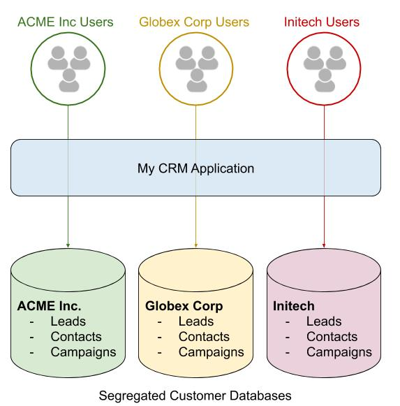

# Example 1 - CRM

This type of application is an ideal fit for Budibase.

Characteristics:

* Multiple groups or teams of users
* Each group accesses their own set of data
* Groups do not share data. They are segregated from each other

