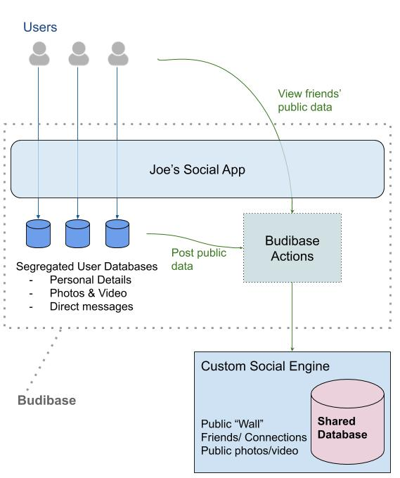

# Example 2 - Social Network

**Parts** of this type of application can be created with Budibase.

Characteristics:

* A private database per user - to store data specific to the user
* A separate "social" engine, which manages data that is shared across all users
* Budibase Actions would be used to integrate Budibase with the Social Engine

In this scenario, Budibase may be used to develop the user specific parts, i.e. the user's private data.

The "Social Engine" cannot be handled by Budibase. This represents a large, shared service, used by all users.

The entire frontend can still be built using Budibase.

