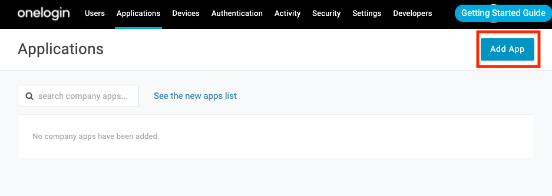
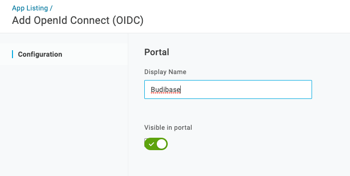
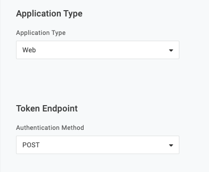

# Auth0

## OpenID Connect

To become familiar with OpenID Connect in Budibase, see:



## Configuration

### Create the application

Create the budibase application in your Applications list.

Type 'openid connect' and select 'Openid Connect (OIDC)'

Give your application a name and save

Visit the 'SSO' tab and choose
- 'Application Type' = 'Web'
- 'Authentication Method' = 'POST'

### Find your configuration details
Visit the 'SSO' tab in your application.

**Client ID**

Use the **Client ID** field as your Client ID in Budibase.

**Client Secret**

Use the **Client Secret** field as your Client ID in Budibase.

**Configuration URL** 

Use the **Issuer URL** field to construct your Configuration URL in Budibase.
e.g. `https://{Issuer URL}/.well-known/openid-configuration`

### Add your callback URL

Visit the 'Configuration' tab in your application and enter your callback URL

