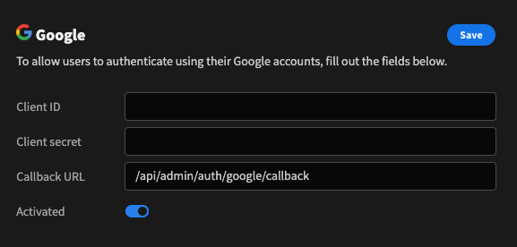

# Authentication and SSO

Budibase currently supports Google OAuth in addition to the built-in authentication solution. To enable it you need to configure it correctly with details from the Google dashboard. You will need your Client ID, secret and Callback URL.

The callback URL you should generally use is the one that authenticates directly with budibase. It is  
 `/api/admin/auth/google/callback`

