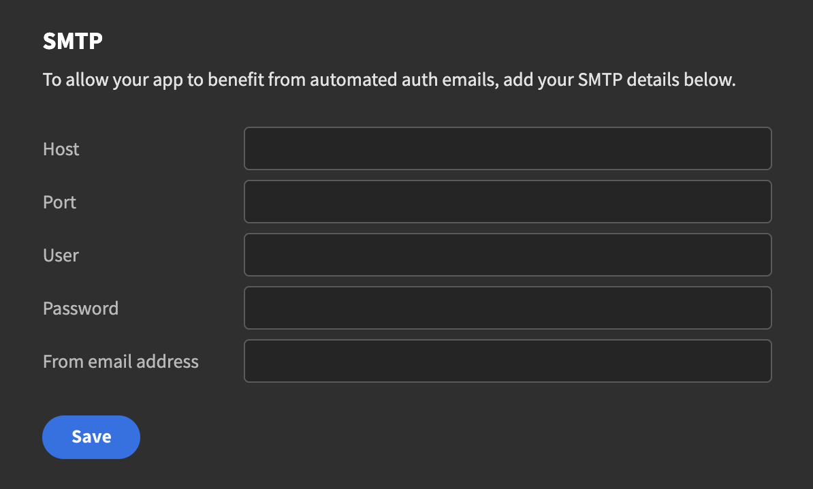
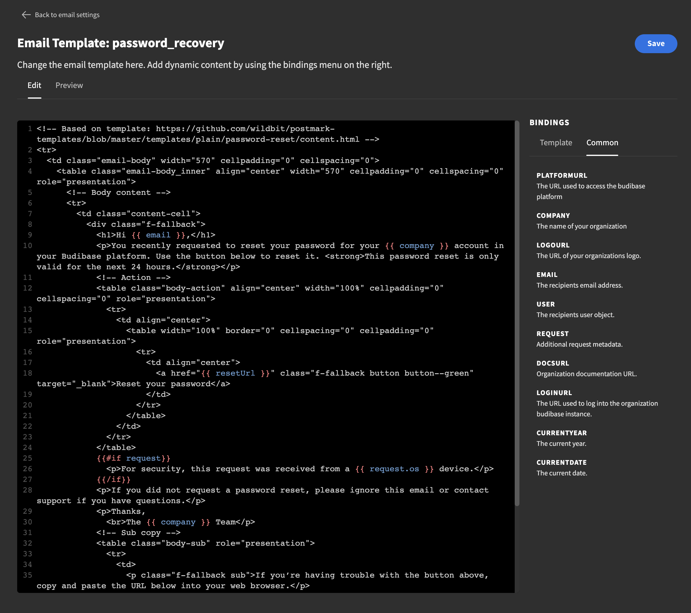

# Email

### Sending Emails

In order for Budibase to be able to send emails you need to set up your SMTP settings. After you have set this up you can [invite users](user-management.md#adding-users) as well as send emails.

### Templates

Budibase comes with a number of email templates so that you can focus on what's important. Currently there are three different ones: `Password Recovery`, `Invitation` and `Welcome`. In addition to that you can also create your own custom templates.

To edit a template, just select it in the table and you will be taken to a new screen. To insert dynamic content you can use the Bindings on the right side of the page. This makes it easier to include things such as the users email, your organisations logo or the name of your organisation. When you're done hit the preview button to make sure it looks OK. Then hit save.

