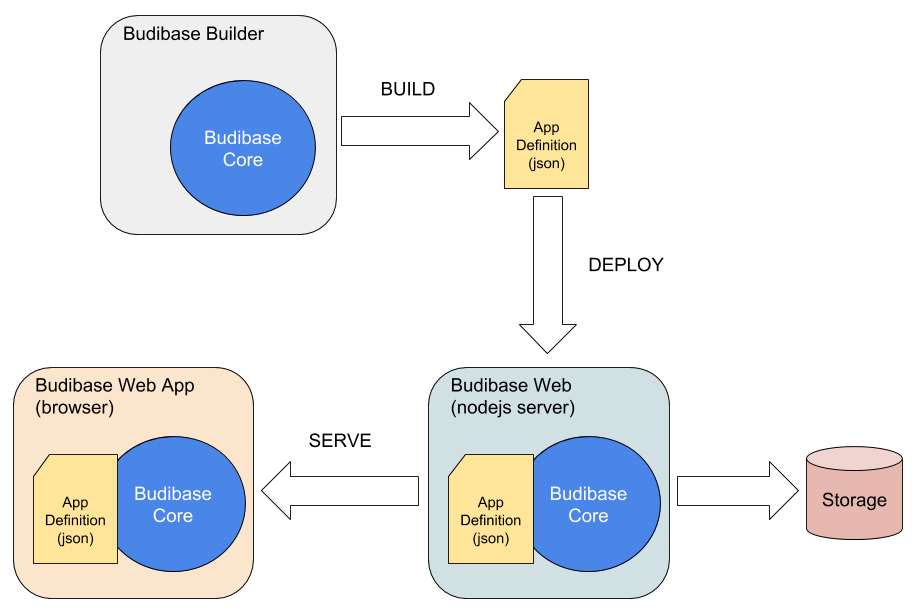

# Budibase Core

Budibase core is a library used by Budibase Apps, Budibase Server and Budibase Builder. It defines and implements all core APIs used in Budibase. It's main purpose is to construct and to understand the "Budibase App Definition".

Here is a quick overview of the usage of Budibase Core.

1. Budibase Builder is used to create an "App Definition" - a set of JSON files that defines everything about an app built with Budibase. The builder is really just a User Interface that wraps Budibase Core. Budibase core defines the APIs used to construct an App Definition.
2. Budibase Web provides and HTTP API for your web app to use. All HTTP Endpoints and behaviors are defined by the App Definition file. Budibase core implements the behaviour of these endpoints (except for any custom endpoints). Budibase web is really just an HTTP wrapper around Budibase core.
3. Your Budibase App's front end presents your app's data, and makes HTTP requests to Budibase Web. Budibase Core is used in your app to understand the App Definition. It allows record/field binding, running validation rules, knowledge of security levels.

## Concepts

### Records

A record is the fundamental unit of data in Budibase. Records are stored as JSON. A record has a schema, that is defined in the app definition. The record's schema will define

1. Fields. Every field must be declared, and will consist of
   - Name. e.g. "last_name". This is the name of the member, as store in JSON
   - Label. e.g. "Last Name". What the field will be labelled in the user interface
   - Type. e.g. "string". Types are listed below
   - TypeOptions. See types below
   - InitialValue. e.g. "(unknown)". The initial value on a new record 
   - DefaultValue. e.g. "(not set)". The value taken if the the loaded JSON object is missing this field.
2. Validation Rules. A set of rules, written in javascript, which are run when a record is created or updated.
3. Collection Name. This defines the "key" (and therefore URL) of the record. e.g. "customers", may cause a record to have a key of "/**customers**/0-6shd8uu""
4. Record Node Id. Each record type will have its own unique integer. this is used to for the record's key. e.g. "/customer/**0**-6shd8uu".
5. Collection Sharding. This defines how a collection of records of this type are stored. At the storage level, all records belong to a "folder". Sharding enables records to be stored across multiple folders, to aid scalability
6. Children. A record may have child records. E.g. "Invoice" may belong to "Customer". See "Heirarchy" below.
7. Indexes. Used to keep a retrievable list of the record's decendants (children, grandchildren etc...). See "Indexes" below.

A Budibase record will always have a "key" member. The key is used to determine the record's type, and thus its schema.

**Heirarchy**

Your database schema are organised in a tree structure. Each node, except for the root, is a record node. 

Below shows an example heirarchy:

In this example, the "customer invoice" node is a child of "customer". Thus, records of this type will always have a key in the format:

`/customers/{parent customer id}/invoices/{invoice id}` 

### Indexes

An index is the only way to retrieve collections of records, i.e. a json array of records. When a record is created, updated or deleted, an index is updated.

## Runtime Responsibilities

On the web server:

- Validates incoming web requests, using schema and rules defined in the application definition
- Authenticates and authorizes incoming requests, using access levels defined in the app definition
- Stores records
- Handles record retrieval from storage
- Manages indexing of records, on create, update and delete. Indexes are defined in the app definition
- Manages users and their levels of access. Users are stored in storage, allowed access levels are defined in the app definition.

In the application front end (browser):

- Automatically binds UI controls to records, using schema defined in the app definition
- Disables/Enables features and actions in the UI, based on a user's access levels
- Knows which fields are available on indexes, for searching and displaying of collections of data records
- When a record is created/updated/deleted, knows which indexes should change, and can update views accordingly, without having to refetch an index.

