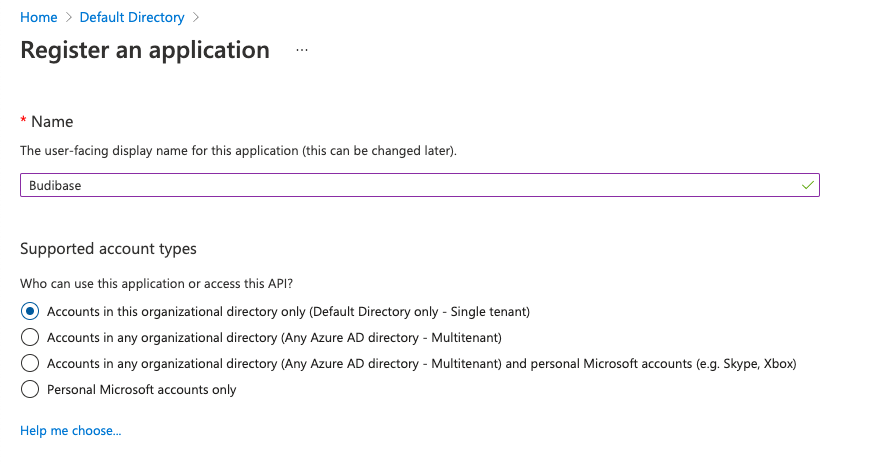
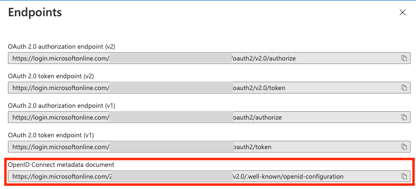
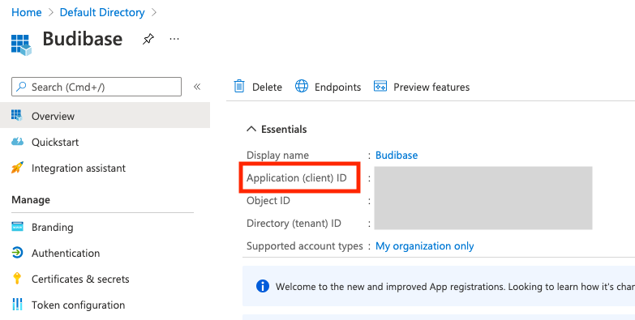

# SSO with Azure AD

## OpenID Connect

To become familiar with OpenID Connect in Budibase, see:



## Configuration

### Create the application

Create the budibase application using a new 'App Registration'

Add the application name

Ignore the Redirect URI for now.

### Find your configuration details

**Configuration URL**

Visit 'Overview' &gt; 'Endpoints'.

Use the **OpenID Connect metadata document** field as your Configuration URL in Budibase.

**Client ID**

Visit 'Overview'

Use the **Application \(client\) ID** field as your Client ID in Budibase.

**Client Secret**

Visit 'Certificates & secrets', click on 'Add client secret', give your secret a description / expiry and save.

View your newly created secret

Use the **Value** field as your Client ID in Budibase.

### Add your callback URL

Visit 'Authentication' and enter your callback URL

