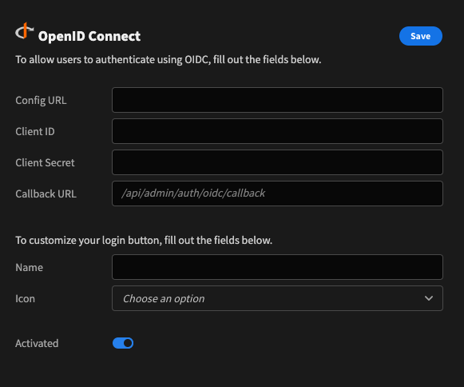

# OpenID Connect

OpenID Connect \(OIDC\) is a simple identity layer built on top of the OAuth 2.0 protocol, which allows clients to verify the identity of an end user based on the authentication performed by an authorization server or identity provider \(IdP\), as well as to obtain basic profile information about the end user.

## Setup

To enable OIDC for your IdP follow the setup steps below.

### Configure your IdP

Any provider that supports the OIDC protocal can be integrated into Budibase, you may even implement your own.

Guides on how to setup some of the most common providers can be seen below:









See also:

[ADFS by Microsoft](https://wiki.resolution.de/doc/openid-oauth-authentication/latest/setup-guides/adfs-setup-guide)

**Callback URL**

* During your configuration you will need to enter the Callback URL for your Budibase installation. 
* For example: `https://{your-budibase-host.com}/api/admin/auth/oidc/callback`

### Configure OIDC in Budibase

To configure an OIDC integration in Budibase visit the `Auth` section of the builder.

Fill in the following options from your IdP:

* **Config URL**
  * URL where Budibase can find the [OpenID Provider Configuration Document](https://openid.net/specs/openid-connect-discovery-1_0.html#ProviderConfig)
  * For example: `https://{your-identity-provider.com}/.well-known/openid-configuration`
* **Client ID**
  * Your unique ID issued by your IdP
* **Client Secret**
  * Your unique secret issued by your IdP

Save the configuration to enable OIDC on your login page.

### Customize your login

Use the login configuration options to customize the OIDC login button.

Fill in either of the following:

* **Name**
  * The name on the login button. This will be substituted at `Sign in with {name}`
* **Icon**
  * The icon on the login button. Choose from:
    * One of the default icons
    * Upload a custom icon

## Important information

Some additional details on the OIDC integration are highlighted below.

**User provisioning**

Unlike the Google integration which requires a local user account to exist in advance, OIDC users are created in Budibase automatically when they log in for the first time. It is important that only the users you wish to access Budibase have been assigned to the application configured in your IdP.

You may still use email onboarding to create an account for a user in advance, provided the email matches the user's email in your IdP.

