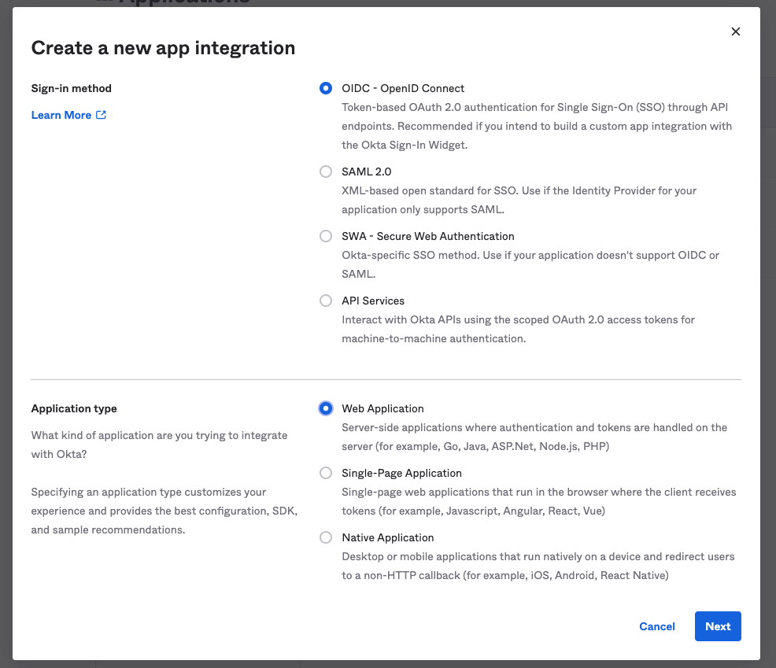
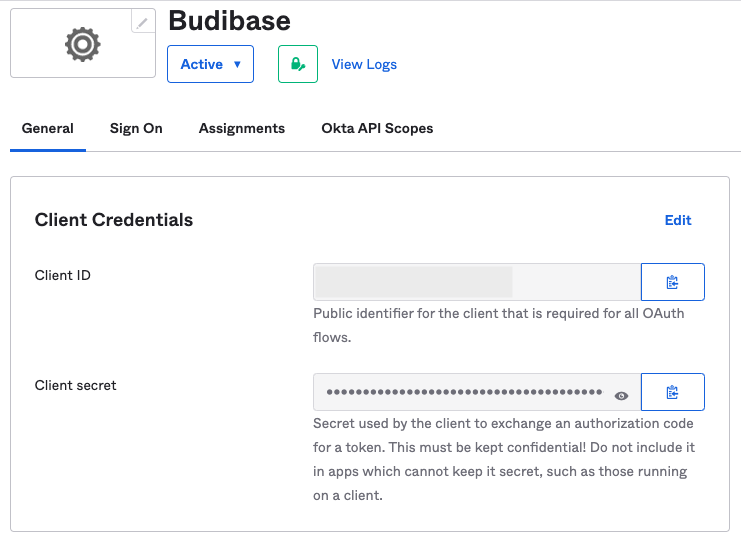
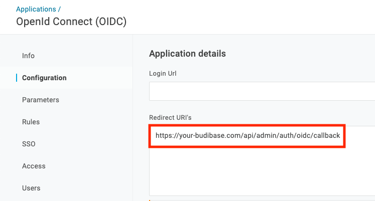

# SSO with Okta

## OpenID Connect

To become familiar with OpenID Connect in Budibase, see:



## Configuration

### Create the application

Create the budibase application in your Applications list.

Select 'OIDC - OpenID Connect' and 'Web Application'

Enter your application name on the next screen and save.

### Find your configuration details

Visit the 'General' tab in your application.

**Client ID**

Use the **Client ID** field as your Client ID in Budibase.

**Client Secret**

Use the **Client Secret** field as your Client ID in Budibase.

**Configuration URL**

Visit the 'Sign On' tab in your application.

Use the **Issuer** field to construct your Configuration URL in Budibase. e.g. `https://{Issuer}/.well-known/openid-configuration`

### Add your callback URL

Visit the 'General' tab in your application, scroll down and edit the 'General Settings' section. Enter your callback URL

