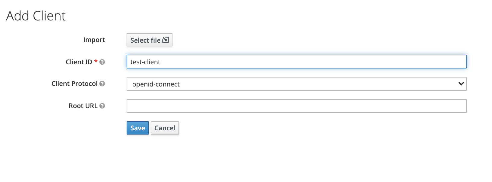

# SSO with Keycloak

To become familiar with OpenID Connect in Budibase, see:



## Configuration

### Add a Client

Create a new client by visiting the 'Clients' pane from the left hand side of your Keycloak admin console. Then give it an ID and select 'openid-connect' from the dropdown. Alternatively bypass this step if you have a client already created. 

### Configure the Client

In the Client configuration screen \(accessed by clicking on the Client ID within the Clients pane\), change the 'Access Type' dropdown to be 'Confidential'.

Next add the Callback URL to the 'Valid Redirect URIs' field ands then click 'Save'

### Find your configuration details

#### Client ID

The Client ID field in Budibase should be the same ID as you gave the Client in Keycloak earlier.

 

#### Client Secret

You can find the Client Secret from the Credentials tab in the Client Configuration screen

#### Configuration URL

Visit the 'Realms' pane from the left hand side of your Keycloak admin console. Then click on the OpenID Endpoint Configuration link and copy the URL that opens. 

 

