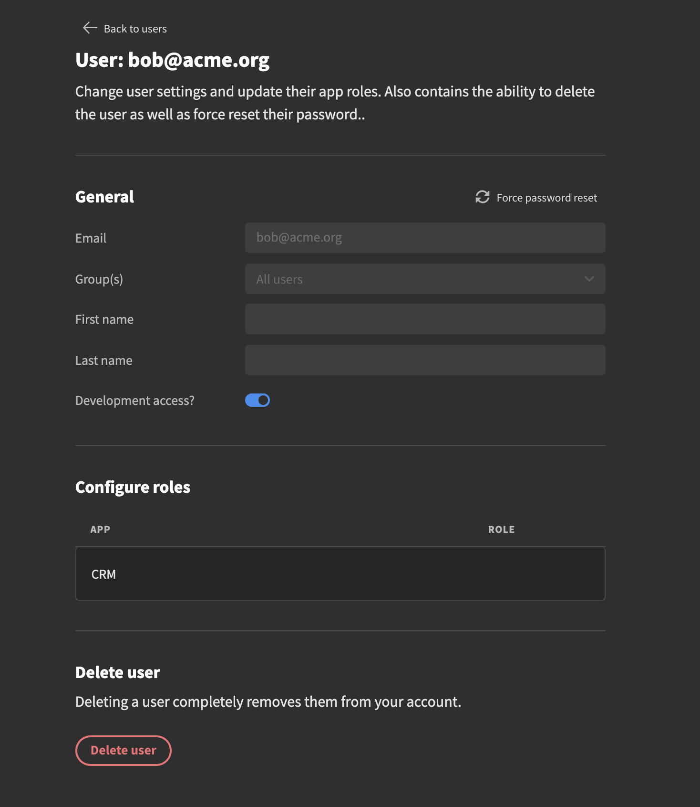

# User Management


In budibase, users are shared across your whole budibase installation. Users can sign into any app that they have access to.


## Adding users

After creating your Admin user account you will have access to the User Management page. This is where you will invite and create new users.

To add a user, hit the Add user button in the top-right part of the page. You will be presented with a modal containing a dropdown as well as an input field. 

The first option here is the regular \`Email onboarding\` flow. In order to use this you must first configure your[ email settings](user-management.md). Simply enter the users email and hit the add user button. Budibase will send-off an email containing an Invite link that the user will have to click. You can customize the invitation email in the [email settings](user-management.md).

The other option is to select the \`Basic onboarding\` flow. Here you'll create the user directly, by-passing the email sending step. Enter an email here and copy the password that is automatically generated for you. Hit the create user button. It is best practice to change the password as soon as possible, as it's just a temporary one.

## Editing users

### Resetting passwords

If you need to force reset a users password you can do that as well. The user gets a temporary password that they can use to login. Once logged in they will be prompted to change their password before continuing on.

### Configure user roles

When you have created your users you can change their roles. To get started click the user row which you want to edit and you will be taken to a new page.

Here you'll see information about the specific user. This is where you can reset passwords and update user app roles.

To change the role for the specific user click the table. You'll see a modal with a list of roles that are relevant to the app.

### Deleting a user

At the bottom of the user page you can find a Delete user section. Hit the delete user button.

