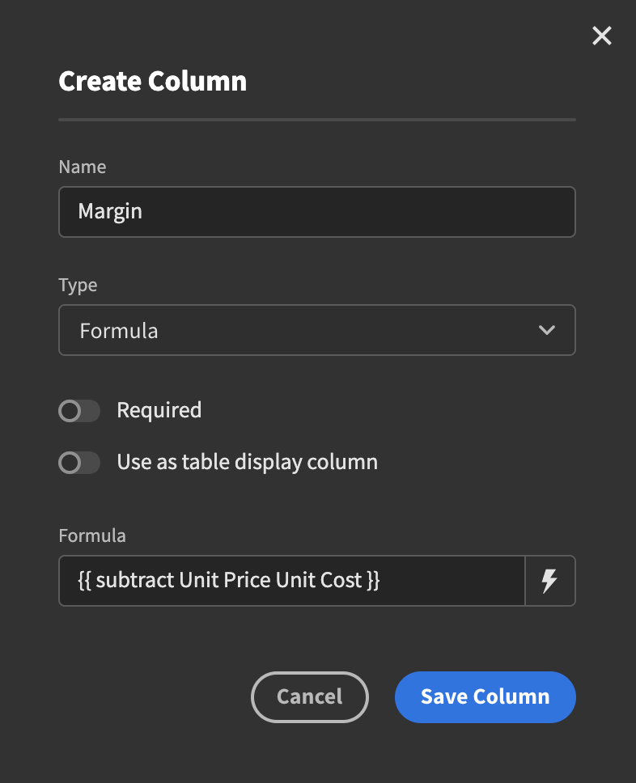

# Formula

Just like with the other data types, start by creating a new column. Select Formula and you will be presented with a textbox. Use Handlebars to construct the expression you are interested in and hit the Save Column button.

If you want some assistance when writing your expression you can click the lightning bolt icon to the right of the formula field. This will open a modal where you can select the fields and handlebars expressions you want directly.

