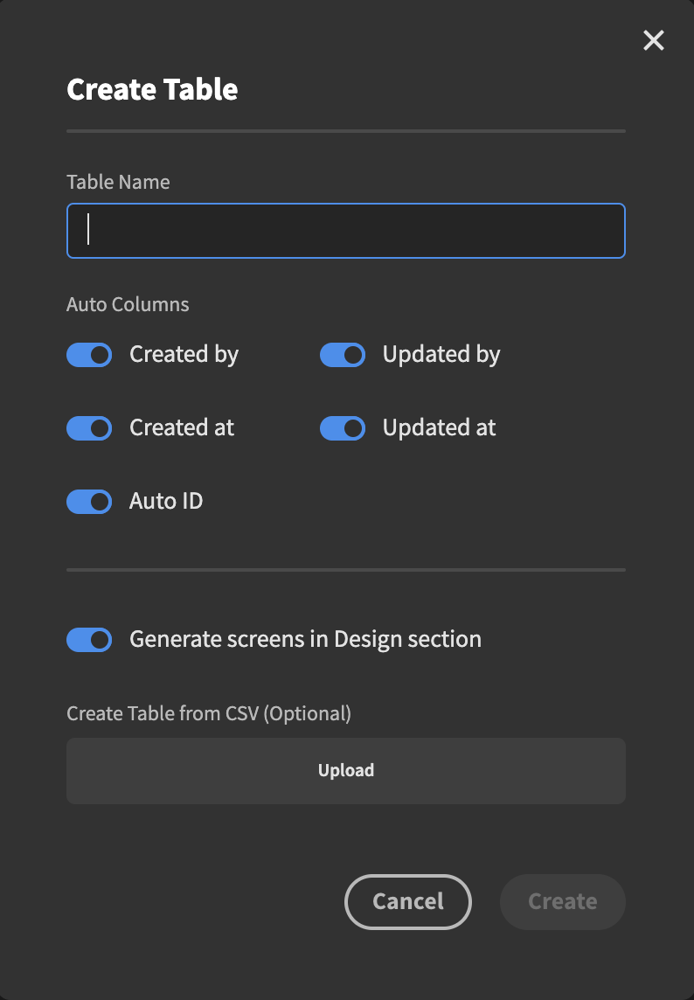
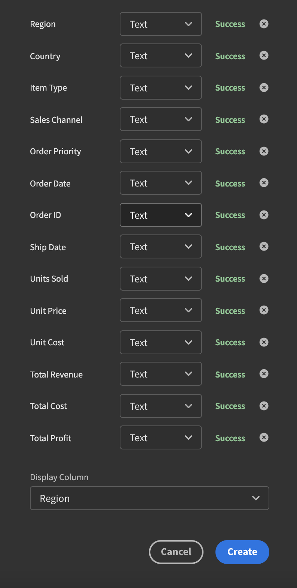
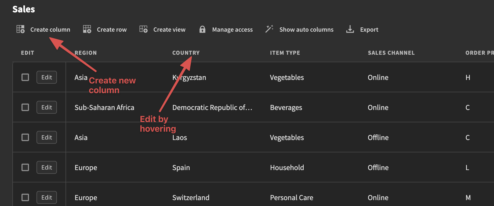

# Internal/CSV

This datasource is the one that is native to Budibase. Any data you add here is stored directly on your Budibase instance.

### Creating a table

Creating the table itself is pretty straight forward. Go ahead and enter a name. 

Next up you have a number of "Auto Columns" you can pick and choose from. These columns will tell Budibase to add some extra information when new records are added or updated.

For example, selecting `Created by` and `Updated by` will add data to your records who created or updated the record is. Selecting `Created at` and `Updated at` will show you when a record was created and updated. The `Auto ID` option will add an auto incrementing ID column to your records so you can keep track of them more easily.

There's also a `Generate screens in Design section` option. Selecting this will auto generate screens in the front-end. We will talk more about this when we get to the [Design](broken-reference) section.

### Importing Data

If you already have some data in the form of a CSV you can upload one here. Let's take a look at that. If you want to play around with a sample you can go ahead and use the one that has been added below.


Sample CSV


When you have uploaded your CSV you will be presented with a number of new options. One for each column. It will look something like this:

Before you create your table you need to select what types each column should have. At the moment you can select between `Text`, `Number`, `Date`, `Option` and `Boolean`. It's very important that you select the correct thing here as the type is what determines much of what you can do with it later on in the [Design](broken-reference) section.

As only you know what your data looks like you will have to pick what makes sense here. **Text** is generally used for things like descriptions, long-form content, IDs containing letters among other things.

**Number** is a type that you should use when working with numbers; sales numbers, number of items in some inventory, revenue, profit, etc.

**Date** is for things like date of sale, shipping dates and so on.

**Options** can be used when you want a user to be able to pick between a number of different options. For example. In the Sales CSV that we imported above there's a `Sales channel`column. It has two options: online and offline. When a user wants to add a new sale, this will allow them to pick between these two options rathern than type it in manually - much less error prone.

Picking something that does not make sense will result in a warning next to the column.

### Adding or Editing Columns

Once you have imported or created a table you see it added to sidebar on the left under `Sources`. If you want to add or edit new column types you can do so by clicking the `Create column` button or by hovering on one of the already existing columns and clicking on the small edit button that appears.

### Datatypes

When creating a table from scratch (not importing) you have access to some extra datatypes such as `attachment`, `Long form text`, `Relationship`, `Formula` and `Auto Column`.  We explore these in more detail on the[ Data types page.](../data-types/)

### Adding data

Adding data is simple. click the `Create row`button and you will be presented with a modal. Fill in all the data and hit save. If you set up your column types correctly when you created or imported your table you will now see the correct controls here. A date picker, option picker, etc.
