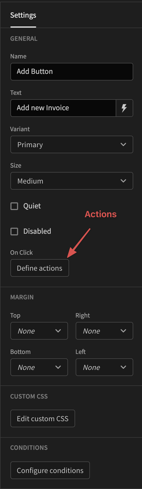
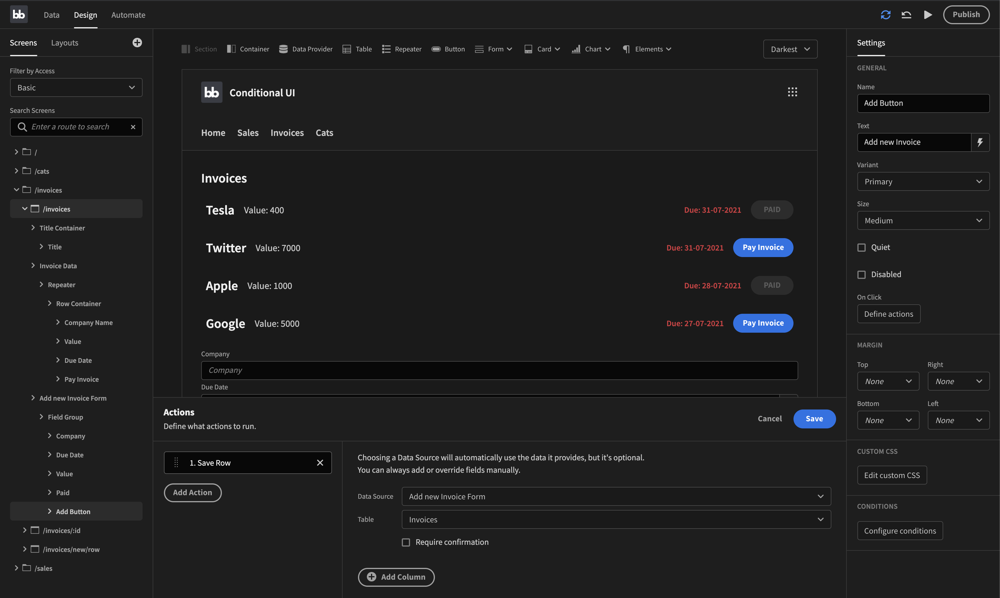
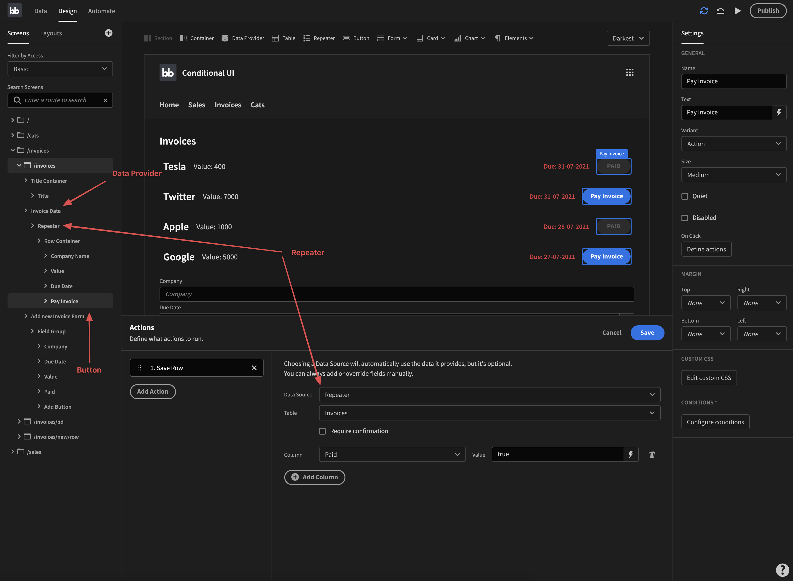

# Actions

Often you want to run automations or update data when a user presses a button. This is what actions are for.   To define your actions, click the `Define actions`, a drawer will appear where you can add, or remove actions tied to this component.

The list of available actions are listed below:

* Save Row
* Delete Row
* Navigate To
* Execute Query
* Trigger Automation
* Validate Form
* Log Out
* Clear Form

### Save Row

Saving a row can mean two things, updating or adding a new row. Depending on what you want to do you will have to structure your code differently.

If you're adding a new row the easiest way is to add a Form component. Once you've set that up correctly you add a button to it and select the `Save Row` action. You then select your form and the table you want to save it to. That's it. An example of how it might look is below.

Updating a row can be done in a number of different ways. If you have a structure containing a Data Provider and a Repeater, selecting the repeater as your Data Source will make it so you can correctly get the values from the specific row. To change a field you then take advantage of the `add column` button that is at the bottom. Click it, select the field you want to change and type in the value you want to change it to \(or use a binding\). A descriptive image of this is shown below:

### Delete Row

This action is used to delete rows from your data source. It's used much in the save way that you would when updating a row.

### Navigate To

Use this action if you want to go to another page. This can be used to navigate back to a dashboard after adding a new row to a table among other things.

### Execute Query

The queries that you have created in the backend can be triggered via this action.

### Trigger Automation

If you have set up an automation you can use this to trigger it.

### Validate Form

Whenever you want to add a new row to a table you might find yourself wanting to validate the data before you send it off. This action is perfect for such use-cases.

### Log Out

If you want to log a user out, you can use this action

### Clear Form

An action that is used when you want to clear a form.

