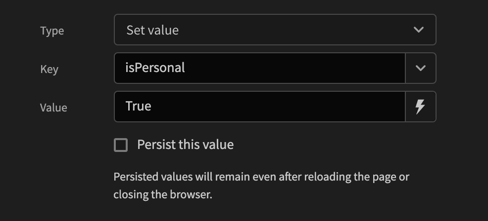

# App State

App state is a generic store of values that can be used to easily pass values around and persist them between navigation and page reloading.

Unlike other bindable values, App state values can be set and used anywhere in your application. Nesting is not required. To set an app state value you can use a new action called `Set Value` in the actions drawer. There are two types; Setting or Deleting a value. When selecting a key the combobox will show all the existing app state values across your application. If you want to add a new one you simply type a new one into the box. After this, you can enter any arbitrary value into the value input field. In addition to static values, you can also use bindable values here.

### Persisting values

If you wish for the values that the user has selected to persist you can select the `Persist this value` checkbox beneath the key/value fields. Doing so will save the value in the users browser using the localStorage API.

### Deleting values

Deleting a value will delete it permanently and will also override values that are persisted.

### Referencing state values

Once you have created a value you are free to bind to it across your application. All values live under the `State` top level bindable value and are visible in the bindings drawer.

For example, To get the value in the example image above you would enter `{{ State.isPersonal }}`.  

