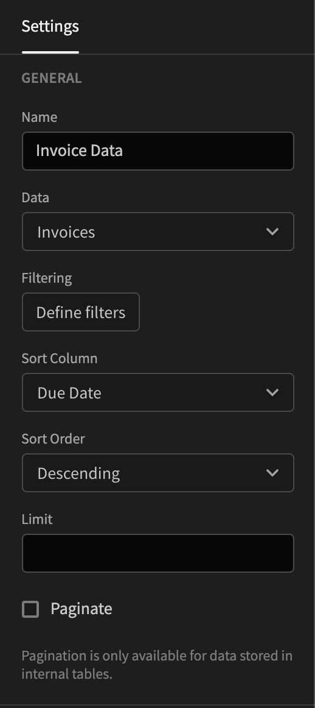

# Data Provider

The data provider component is one of the most important components in Budibase. It exposes data to your children. Whenever you want to use data from your backend or from external sources you need this component. 

In addition to controlling which data source that should be available to your children it also lets you sort and filter your data. For example, let's say that we have a list of invoices in a table. To only show relevant data to the user we simply filter it on the status `isPaid`. 

Once you have added your data provider you need to select which Data source you want to use. It's as simple as clicking the Data setting button.

### Structure

Something that is worth thinking about when working with the Data Provider component is that the component structure is important. Only the children of your provider will have access to the data.

There are a number of different ways in which you can use the Data Provider; Charts, Tables and/or Repeaters.

If you choose to use a Chart or Table you can simply add them as a child and select the provider in the settings. However, if you want to build something a bit more custom, maybe you want a list of cards, then you will need the Repeater component. You can learn more about the Repeater [here](repeater.md). Here's an example of a list of fictive invoices:

