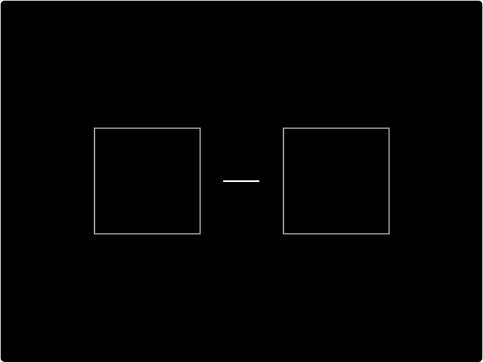

# Link

Use the Link component to offer your users a way to navigate to other destinations. The Link component is built on top of the [Text](text.md) component. Just like the Text component, you can leverage the available styling properties with the Design panel.

## How to add a Link:

To add a Link to your designs:

* [ ] Click the `Link` button
* [ ] Add text to your link
* [ ] Either select an option from the URL dropdown or add a URL



## How to style your Link

The Link button accepts the majority of properties within the Design panel. A common style update to the Link component is to remove the underline. To do this, click `Design `, then open the Typography settings,  reset the **Decoration** to `None` . This may already be on None. If it is, reselect None and it should work.



