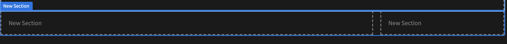
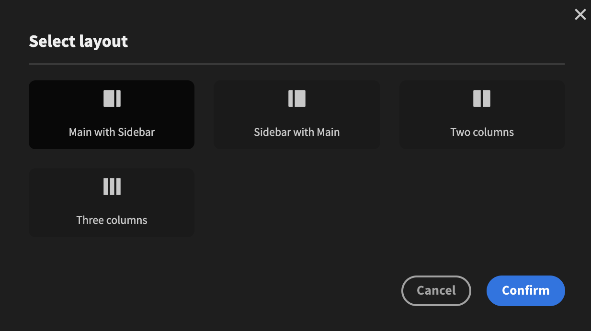

# Section

The Section component can only be used as a top-level component. It's main use is to split up your content into multiple columns. This is a great component to use when building something like a dashboard.

The section takes an unlimited number of children; the first one will be placed in the first column and the second in the second column and so on. If you add more children than there are sections it will wrap-around and start from the first column again.

You can change number of columns by changing the Type setting. There are currently four different layouts: `Main with Sidebar`, `Sidebar with Main`, `Two Columns` and `Three columns`.

