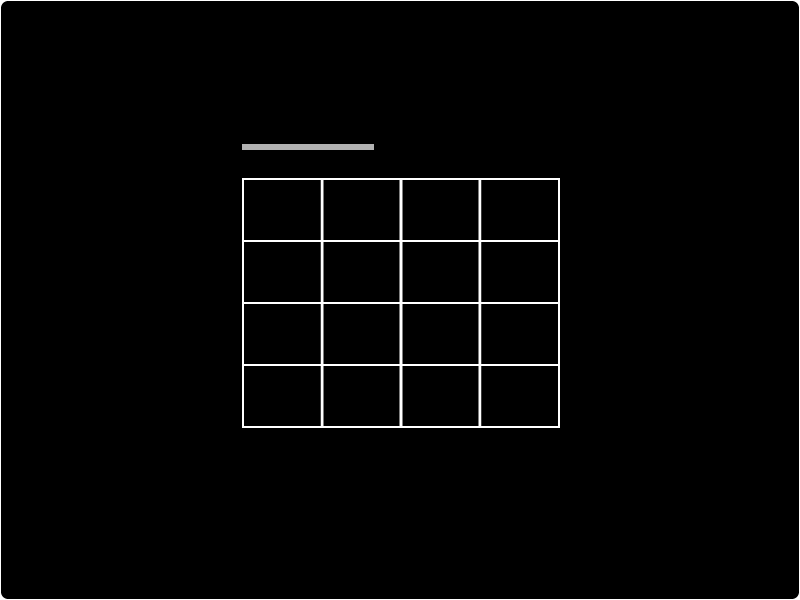

# Table

Use the Table component to display data from your tables to users. With the Table component, your users can create, read, update, and delete data within the Table component, which will automatically update the data in your Tables.

## How to add a new Table

To add a new form to your designs:

* [ ] Click the `table` button
* [ ] Within the settings panel, connect your Table component to a table in your data section.

