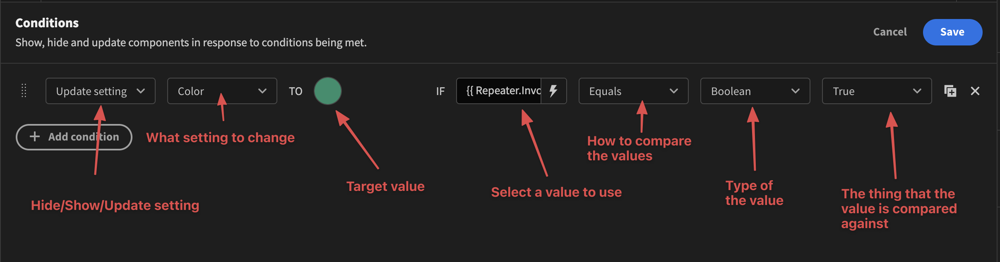
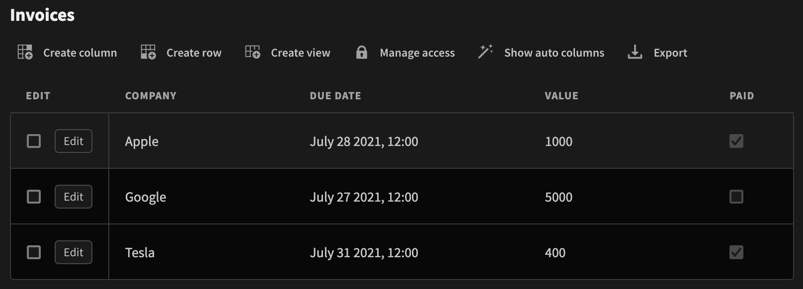
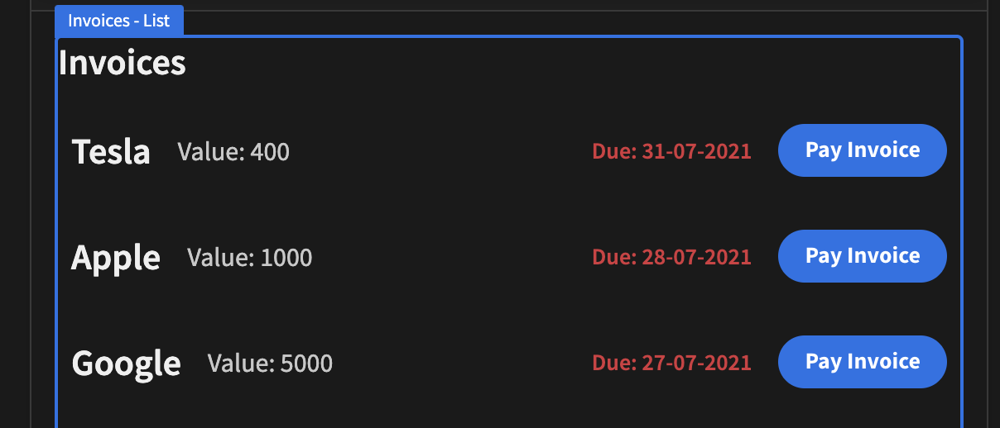
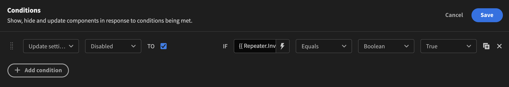
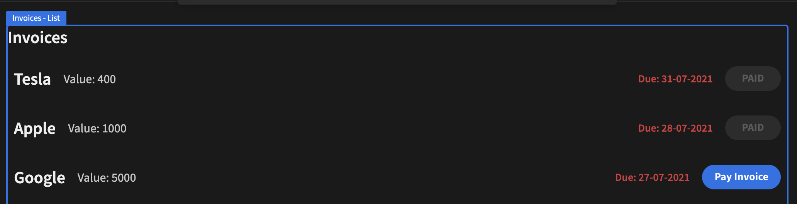

# Conditions

A lot of the time you want to change the state of some component when certain conditions are true or false. This might be changing a color from red to green, showing or hiding a component. You will find the condition settings at the very bottom of the settings panel of your components. 

Adding a condition is simple. Once you click the settings button a drawer will pop up and you will be able to add, edit or remove your conditions. It will look something like this

### Adding a condition

To add a condition, simply click the `Add condition` button. As explained above, you can choose wether to `Show`, `Hide` or `Update setting`. Depending on what you choose you will be presented with different options. They will all contain settings for comparing some value against another.

### An example

In the example we're going to discuss we have a simple backend table that contains three records. It looks like this:

As we can see, there are four fields, Company, Due Data, Value and Paid. In the Design section we have designed a simple interface showing each of our invoices in rows. It looks like so:

It would be great if the `Pay Invoice` button was in a disabled state if the invoice has been paid. So let's go ahead and add a condition to do just that!

Select the button component in the tree view on the left. Open the conditions drawer and select `Update setting` and then pick the Disabled setting in the dropdown. Make sure the checkbox is checked. We then need to figure out which field we want to check. In our case it's found under `{{ Repeater.Invoices.Paid }}`. This will of course differ depending on the structure of your application. If you click the little lightning bolt icon you will be able to see which fields are available for use.  Now we just make sure that it equals TRUE. Hit save, and that's it!

Now that we have this condition set up we might also want to change the text of the button to say "PAID". To do that, simply click the copy button and change the setting to "text". Change the text to "PAID" and hit save.

And here's the end result.

