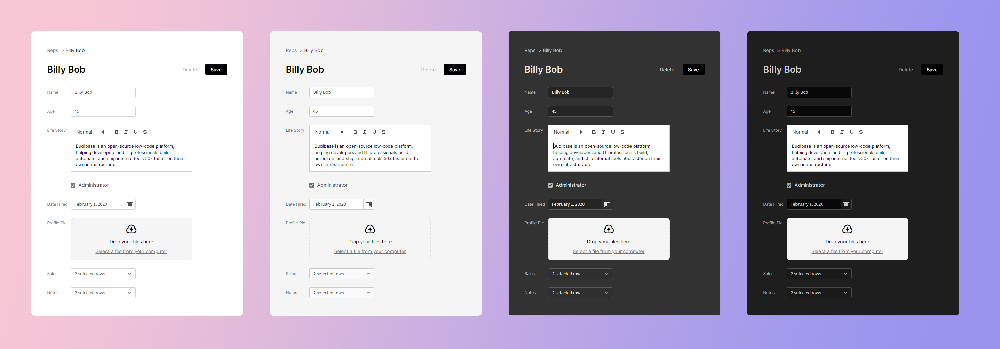

# Forms

Forms are the primary building blocks of any data heavy applications. With Budibase you can build rich, themeable forms to create and edit your data.

### Overview

Forms are built up from 3 main component types - a form component, field group components and field components. It's important to understand the best component layouts for forms, so you can take advantage of features like embedding any other content inside forms, or using data bindings to link up your form to other components.

#### Embedding Non-Form Content

Forms can contain any content - not just field groups and fields - so you can easily nest any other components alongside your form components. The best way to achieve this neatly is to always put groups of fields inside a field group component, then you can simply include any other components inside your form, beside the field groups.

#### Validation

Forms automatically validate their fields if a form schema has been set, and they'll show validation errors. Forms provide a [button action](../actions.md) to validate the form programmatically, which you'll probably want to trigger when using the data from the form. This action will trigger the form validation, show any errors, and stop executing any further actions if the form is invalid. The recommended way to use this is for your first button action to be validating the form, and the second action to be performing your task - for example saving a row. This ensures only valid forms will be submitted.

### Form Building Blocks







### Video Guides





 

