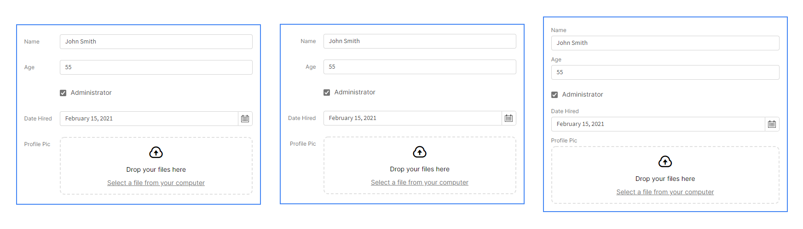

# Field Groups

Field groups are components which group fields together. They allow your fields to be neatly aligned with each other, and let you style you fields with consistent label positions.

### Field Group Settings

Field groups are simple group components, so  they don't have many settings. 

| Setting | Required | Description |
| :--- | :--- | :--- |
| Name | Yes | The name of the field group component |
| Labels | Yes | The position of the field labels |

#### Label Positioning

Each field component has a label associated with it, showing the name of the field. Field groups let you align your labels for multiple fields, to keep them looking neat and consistent. There are 3 different options for label positions - left aligned, right aligned and above your field.

### Generating Fields Automatically

Field groups have a powerful function which can save you a lot of time when working on forms - they let you reset them, which automatically populates them with all the fields in your form schema. This means you can generate a full form in one click, or you can add in missing fields if you change your schema.

When you select a field group component in the builder, you'll be able to press "Reset Fields" in the settings panel to perform this function.

