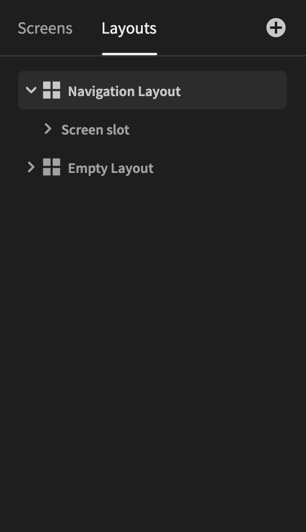
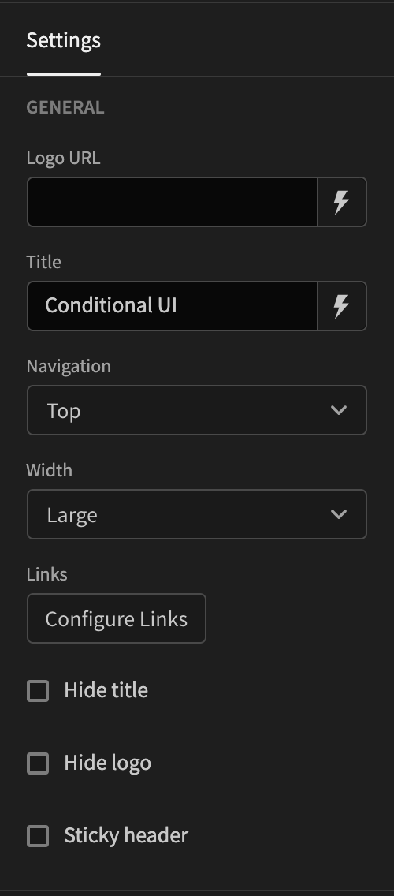

# Layouts

Budibase uses layouts that wrap your screens. This is where you put components that you want to display across different screens. Basically a shortcut for you, so you don't have to re-build the same thing over and over.

All Budibase applications start off with two Layouts: `Navigation` and `Empty`. On the right-hand side you can see all the options that are available to you. The difference between the two starting layouts is that the navigation is turned off in the `Empty`layout. Other options you will find here is the `Links`, where you can configure the navigation links, text options and some other goodies.

