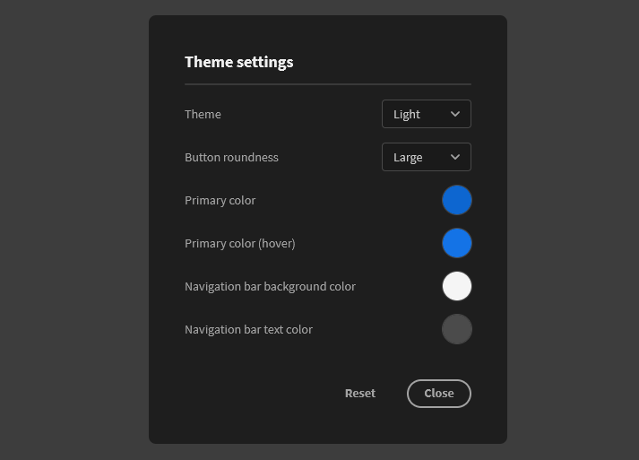

# Themes

Budibase uses the Spectrum design system by Adobe. Included are four base themes; Lightest, Light, Dark and Darkest.

If you are not satisfied with the base themes you can customize the options below:

* Primary colour - used for the action variant on buttons, form fields \(icons, checkboxes, radios, borders and datepickers\), icon colours, etc.
* Primary colour \(hover\) - like the previous one but when the element is hovered.
* Navigation bar background colour: the background colour of your navigation bar. This also includes the drawer menu when on mobile.
* Navigation bar text colour - the text colour of your navigation bar. 

