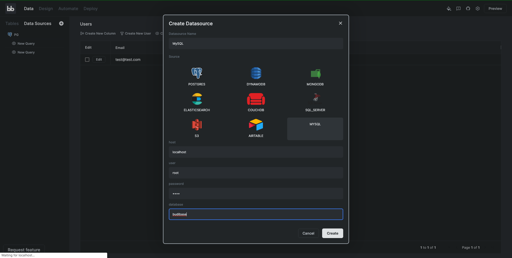
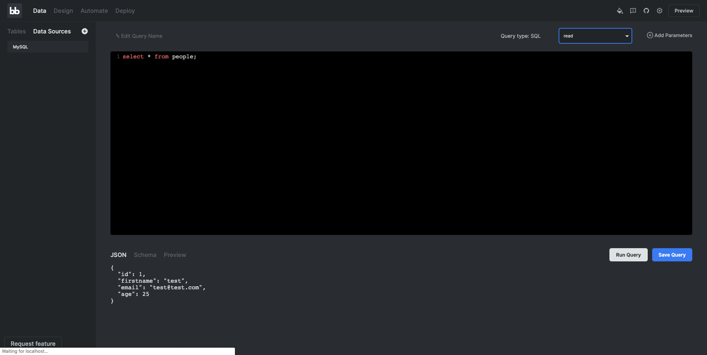
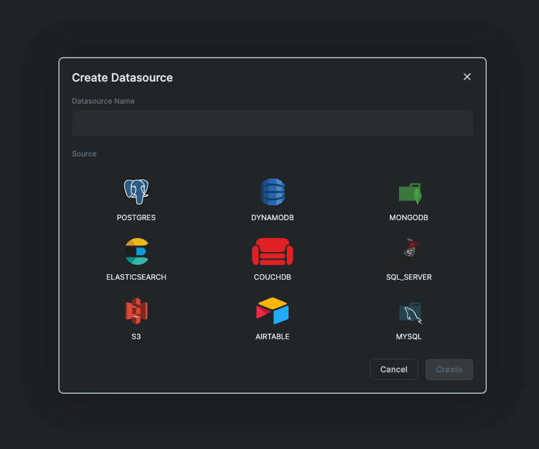

# Writing Your Own External Data Connectors

## What are External Data Connectors?

**External data connectors** are modules that allow you to connect your budibase application to a whole host of database and API technologies. You can connect your budibase apps to relational databases, HTTP APIs and more. You can find a list of all the currently supported budibase data connectors [here](https://github.com/Budibase/budibase/blob/master/packages/server/src/integrations/index.js).

## Data Connector Structure

> #### To see real world examples of data connectors in budibase, have a look through the existing ones [here](https://github.com/Budibase/budibase/blob/master/packages/server/src/integrations/index.js).

Data connectors are made up of **datasources** and **queries**. 

A _datasource_ usually points to a single database instance or API. 

_Queries_ are the different data fetching operations _against_ a datasource. 

For example, your local postgres instance would be a datasource, and you can create a whole host of different queries against that postgres instance. You can bind budibase UI components to queries - such as grids, tables, repeaters and more.

When writing a data connector, you need to define **two** things in your code:

* **Schema -** This defines the options for the data connector.
* **Integration Code** - A JavaScript class containing the actual code that will be executed by budibase when executing operations against the datasource. The integration class must contain **create, read, update** and **delete** methods.

## Tutorial: Creating a MySQL Data Connector

Let's walk through an example. We are going to create a budibase data connector for **MySQL**, the popular RDBMS**.**

### Steps

* Create schema and integration code
*  Add an icon for the integration
* Test our integration

### Setup

> If you already have MySQL setup, feel free to skip this section and use your own existing MySQL database for this tutorial.

If you haven't installed MySQL, you will need to install it \(docs [here](https://dev.mysql.com/doc/mysql-installation-excerpt/5.7/en/)\). Alternatively, you can run MySQL inside docker, which is the approach we are going to take. [Install docker](https://docs.docker.com/get-docker/), and run the following command to run MySQL on your machine.

```text
docker run --name budi-mysql -p3306:3306 -e MYSQL_ROOT_PASSWORD=my-secret-pw -d mysql
```

#### \(Optional\) Seed your database

You may want to set up a test database and some tables for testing your integration.

Open up the MySQL command line client, or use your favourite MySQL GUI client to connect to your MySQL database. If you are using docker, you can run the MySQL command line client inside docker by running the following command:

```text
docker exec -it budi-mysql mysql -p my-secret-pw
```

**Create a database**

Once connected, run the following ****commands to set up your database.

```sql
create database budibase;
use budibase;
```

**Create a Test Table**

```sql
create table people (
    id INT(6) UNSIGNED AUTO_INCREMENT PRIMARY KEY, 
    firstname VARCHAR(30), 
    email VARCHAR(50), 
    age INT
);
```

#### **Create data**

```sql
INSERT INTO `people` (firstname, email, age) VALUES ('test', 'test@test.com', 25);
```

Ok, we are now ready to write our data connector!

### Finding a Library

To implement our data connector, we need a library that will allow the budibase server \(Built on NodeJS\) to connect to our database. The simplest choice here would be to just use the official MySQL node connector, a hugely popular and mature library.



Let's install this libary in the server directory.

```text
cd packages/server
yarn add mysql
```

We have now installed MySQL and we are ready to write our integration. Create a new file in `packages/server/src/integrations/mysql.js` with the following contents:

```javascript
const mysql = require("mysql")

const SCHEMA = {
  // Optional link to docs, which gets shown in the UI.
  docs: "https://github.com/mysqljs/mysql",
  datasource: {},
  query: {},
}

class MySQLIntegration {}

module.exports = {
  schema: SCHEMA,
  integration: MySQLIntegration,
}

```

Now it's time to start setting up our schema. You will notice that we've created the main building blocks of a budibase data connector \(schema, integration class\), and exported them. This means we can now just focus on our implementation by filling them out. Let's start by creating our datasource configuration. When you look at the docs for the node MySQL connector, we are told how to configure the client, which looks a little like this:

```javascript
const connection = mysql.createConnection({
  host     : 'localhost',
  user     : 'me',
  password : 'secret',
  database : 'my_db'
});

```

In order to allow users to add these values through the budibase builder, we will need to update our code to look like below. Notice how we have created schema values to match the ones the MySQL client expects. The user fills these values in from the builder and they get passed to our integration.

```javascript
const mysql = require("mysql")

const SCHEMA = {
  docs: "https://github.com/mysqljs/mysql",
  datasource: {
    host: {
      type: "string",
      default: "localhost",
      required: true,
    },
    user: {
      type: "string",
      default: "root",
      required: true,
    },
    password: {
      type: "password",
      default: "root",
      required: true,
    },
    database: {
      type: "string",
      required: true,
    },
  },
  query: {},
}

class MySQLIntegration {
  constructor(config) {
    /**
     * This is the config passed in from the schema. It should look something like this, with your own values:
     * {
     *  host: "localhost",
     *  user: "myuser",
     *  password: "somepassword",
     *  database: "mydatabase"
     * }
     * */
    this.config = config
    this.client = mysql.createConnection(config)
  }
}

module.exports = {
  schema: SCHEMA,
  integration: MySQLIntegration,
}

```

Following our schema configuration, the next part is to create a **query.** We are going to create a simple query to allow us to read data from our MySQL instance. As mentioned in the [**Data Connector Structure**](contribute-data-connectors.md#data-connector-structure) ****section, integration methods must be one of the following:

* create\(\)
* read\(\)
* update\(\)
* delete\(\)

Let's write the code for our **read\(\)** method.

```javascript
const mysql = require("mysql")

const SCHEMA = {
  docs: "https://github.com/mysqljs/mysql",
  datasource: {
    host: {
      type: "string",
      default: "localhost",
      required: true,
    },
    user: {
      type: "string",
      default: "root",
      required: true,
    },
    password: {
      type: "password",
      default: "root",
      required: true,
    },
    database: {
      type: "string",
      required: true,
    },
  },
  query: {
    // The read query takes SQL as a parameter
    read: {
      type: "sql",
    },
  },
}

class MySQLIntegration {
  constructor(config) {
    /**
     * This is the config passed in from the schema. It should look something like this, with your own values:
     * {
     *  host: "localhost",
     *  user: "myuser",
     *  password: "somepassword",
     *  database: "mydatabase"
     * }
     * */
    this.config = config
    this.client = mysql.createConnection(config)
  }

  read(query) {
    // Node MySQL is callback based, so we must wrap our call in a promise
    return new Promise((resolve, reject) => {
      this.client.connect()
      return this.client.query(query.sql, (error, results) => {
        if (error) return reject(error)
        resolve(results)
        this.client.end()
      })
    })
  }
}

module.exports = {
  schema: SCHEMA,
  integration: MySQLIntegration,
}

```

Next we need to add our integration to `packages/server/src/integrations/index.js`. This exports our integration and makes it available to the builder.

```javascript
const postgres = require("./postgres")
const dynamodb = require("./dynamodb")
const mongodb = require("./mongodb")
const elasticsearch = require("./elasticsearch")
const couchdb = require("./couchdb")
const sqlServer = require("./microsoftSqlServer")
const s3 = require("./s3")
const airtable = require("./airtable")
const mysql = require("./mySql")

const DEFINITIONS = {
  POSTGRES: postgres.schema,
  DYNAMODB: dynamodb.schema,
  MONGODB: mongodb.schema,
  ELASTICSEARCH: elasticsearch.schema,
  COUCHDB: couchdb.schema,
  SQL_SERVER: sqlServer.schema,
  S3: s3.schema,
  AIRTABLE: airtable.schema,
  // Our new integration schema
  MYSQL: mysql.schema,
}

const INTEGRATIONS = {
  POSTGRES: postgres.integration,
  DYNAMODB: dynamodb.integration,
  MONGODB: mongodb.integration,
  ELASTICSEARCH: elasticsearch.integration,
  COUCHDB: couchdb.integration,
  S3: s3.integration,
  SQL_SERVER: sqlServer.integration,
  AIRTABLE: airtable.integration,
  // Our new integration class
  MYSQL: mysql.integration,
}

module.exports = {
  definitions: DEFINITIONS,
  integrations: INTEGRATIONS,
}

```

We can now test our new integration from the builder frontend! Open up the budibase builder and create a new application. Go to **Data Sources** and click the plus icon to add a new datasource. Choose our new MySQL integration. There is no icon there for MySQL, but we will add that later on. Click **MySQL** and you will now see your integration options in the UI! Fill in your integration options and click **Create.**



You will be presented with the datasource configuration screen. You can use this screen to edit your datasource configuration should it change. Let's create a query now so we can fetch our data. Click the **Create Query** button.

Write your query and click the **Run Query** button. This will execute your query and determine the schema so budibase knows what columns you have in your table.



It works! We can now save our query and use it in the design section of the builder. This concludes the end to end for our datasource and query configuration. Completing the integration is a matter of filling out the remaining methods in the integration class. ****We are not going to go through all of the separate CRUD methods in the scope of this tutorial - you can see the fully completed MySQL integration here. You also do not need to implement all of the CRUD methods for an integration. It's your choice how many you want your integration to have.

### Adding Our MySQL Icon

To add an icon for your integration, you must add an SVG file with the icon to `packages/builder/src/components/backend/DatasourceNavigator/icons`.

Create \`packages/builder/src/components/backend/DatasourceNavigator/icons/MySQL.svelte\` with the following contents:

```markup
<script>
  export let width = "100"
  export let height = "100"
</script>

<svg
  {width}
  {height}
  viewBox="0 0 147 147"
  fill="none"
  xmlns="http://www.w3.org/2000/svg">
  <path
    d="M128.244 27.5625H83.3444L74.1569
    45.9375H22.9688V124.031H137.812V27.5625H128.244ZM128.625
    45.9375H92.7478L97.5621 36.75H128.625V45.9375Z"
    fill="#2A4B59" />
  <path
    fill-rule="evenodd"
    clip-rule="evenodd"
    d="M73.5827 67.597C72.6671 67.5874 71.7543 67.6986 70.8678
    67.9278V68.061H70.9964C71.6302 69.0199 72.3383 69.9277 73.1141
    70.7759C73.647 71.837 74.111 72.889 74.6393 73.9502L74.7679 73.8169C75.2581
    73.4258 75.6415 72.917 75.8825 72.3379C76.1234 71.7589 76.2141 71.1283
    76.146 70.5048C75.8564 70.0602 75.5911 69.6001 75.3513 69.1267C74.9562
    68.4652 74.0926 68.1345 73.5597 67.6062"
    fill="white" />
  <path
    fill-rule="evenodd"
    clip-rule="evenodd"
    d="M139.319 125.345C134.95 125.032 130.564 125.658 126.457 127.183C125.464
    127.578 123.875 127.578 123.742 128.836C124.275 129.365 124.339 130.214
    124.808 130.959C125.714 132.492 126.878 133.858 128.248 134.997C129.626
    136.058 131.028 137.11 132.488 138.038C135.07 139.632 138.001 140.555
    140.495 142.144C141.956 143.063 143.408 144.262 144.873 145.259C145.599
    145.787 146.058 146.637 146.986 146.977V146.775C146.712 146.039 146.374
    145.329 145.976 144.653C145.314 143.996 144.653 143.394 143.986
    142.737C142.043 140.171 139.72 137.917 137.096 136.053C134.974 134.592
    130.338 132.608 129.479 130.164L129.346 130.031C130.906 129.811 132.443
    129.454 133.94 128.965C136.186 128.372 138.24 128.506 140.56 127.913C141.621
    127.647 143.541 126.994 143.541 126.994V125.961C142.356 124.785 141.51
    123.204 140.266 122.097C136.876 119.139 133.264 116.447 129.461
    114.045C127.426 112.735 124.808 111.885 122.649 110.769C121.868 110.374
    120.558 110.181 120.099 109.524C119.022 107.943 118.121 106.248 117.412
    104.471C115.475 100.744 113.684 96.944 112.042 93.0786C111.076 90.527
    109.961 88.0344 108.702 85.6138C102.629 75.3049 93.8692 66.8402 83.3582
    61.1245C80.7056 59.8389 77.8847 58.9342 74.9792 58.4372C73.3392 58.3683
    71.7038 58.2396 70.0685 58.1753C69.0107 57.4823 68.0036 56.7147 67.055
    55.8784C63.3202 53.5218 53.7009 48.4136 50.9493 55.1572C49.1807 59.4156
    53.5677 63.6051 55.0836 65.7688C56.3514 67.2941 57.4683 68.9387 58.4187
    70.6795C58.8781 71.7912 59.0067 72.9764 59.4707 74.1524C60.4281 77.1443
    61.5648 80.0758 62.8746 82.931C63.5769 84.3429 64.3863 85.699 65.2956
    86.9873C65.8238 87.7131 66.738 88.0347 66.9355 89.2199C66.2106 90.78 65.7036
    92.4324 65.4288 94.1306C64.2846 97.7426 63.8637 101.545 64.19 105.32C64.5163
    109.094 65.5835 112.768 67.3306 116.13C68.378 117.765 70.8678 121.372
    74.2212 119.993C77.1658 118.817 76.5181 115.083 77.3633 111.812C77.5609
    111.022 77.4276 110.503 77.8227 109.974V110.618C77.8227 110.618 79.4948
    114.293 80.3217 116.171C82.5698 119.591 85.3631 122.618 88.5905
    125.134C89.8767 126.245 90.9145 127.614 91.6361
    129.153V130.339H93.1153C93.0837 129.805 92.9362 129.285 92.6832
    128.815C92.4301 128.344 92.0775 127.935 91.6499 127.614C90.4391 126.367
    89.33 125.024 88.3332 123.6C85.6231 119.742 83.234 115.669 81.1899
    111.421C80.1655 109.34 79.2743 107.071 78.4337 104.99C78.0524 104.191
    78.0524 102.983 77.4139 102.583C76.2312 103.981 75.2053 105.505 74.3544
    107.126C73.3203 110.403 72.7195 113.8 72.5675 117.233C72.3148 117.301
    72.4388 117.233 72.3148 117.366C70.2752 116.833 69.5586 114.61 68.8052
    112.772C66.8219 107.009 66.6218 100.781 68.231 94.9023C68.6903 93.5242
    70.5967 89.0821 69.825 87.7453C69.4391 86.4682 68.1666 85.7378 67.4638
    84.7318C66.5711 83.3765 65.8024 81.9436 65.1669 80.4504C63.6372 76.7065
    62.8701 72.5538 61.2117 68.8098C60.2956 67.0053 59.2292 65.2811 58.0236
    63.6557C56.6915 62.031 55.5163 60.2837 54.514 58.4372C54.2707 58.0251
    54.1215 57.5643 54.077 57.0878C54.0326 56.6113 54.0939 56.1309 54.2568
    55.6809C54.2928 55.4547 54.4023 55.2467 54.5684 55.0889C54.7344 54.9312
    54.9478 54.8325 55.1755 54.8081C56.0024 54.0731 58.3636 55.0056 59.1905
    55.4099C61.4133 56.2841 63.5306 57.4059 65.5023 58.7541C66.421 59.4248
    68.4974 61.1245 68.4974 61.1245H69.1176C71.2353 61.5839 73.624 61.2531
    75.6085 61.8503C78.9646 62.967 82.1671 64.5011 85.1406 66.4165C93.9149
    72.002 101.049 79.8174 105.812 89.0637C106.607 90.5842 106.942 91.9761
    107.65 93.561C109.028 96.8133 110.764 100.125 112.152 103.3C113.372 106.43
    114.951 109.408 116.856 112.175C117.848 113.553 121.822 114.293 123.609
    115.023C125.17 115.557 126.703 116.17 128.202 116.86C130.453 118.239 132.7
    119.842 134.822 121.367C135.879 122.162 139.191 123.815 139.388 125.143"
    fill="#F3FDFF" />
</svg>

```

Now we need to update `packages/builder/src/components/backend/DatasourceNavigator/icons/index.js` to include our new icon.

```javascript
import Postgres from "./Postgres.svelte"
import DynamoDB from "./DynamoDB.svelte"
import Elasticsearch from "./Elasticsearch.svelte"
import MongoDB from "./MongoDB.svelte"
import CouchDB from "./CouchDB.svelte"
import S3 from "./S3.svelte"
import Airtable from "./Airtable.svelte"
import SqlServer from "./SQLServer.svelte"
import MySQL from "./MySQL.svelte"

export default {
  POSTGRES: Postgres,
  DYNAMODB: DynamoDB,
  MONGODB: MongoDB,
  ELASTICSEARCH: Elasticsearch,
  COUCHDB: CouchDB,
  SQL_SERVER: SqlServer,
  S3: S3,
  AIRTABLE: Airtable,
  MYSQL: MySQL,
}

```

Our icon has been added! Now when we open the datasource creation menu, the builder will contain our new icon.



## Data Connector Schema Reference

Here is the total schema for budibase data connectors. This is written using the TypeScript type notation.

```typescript
type QueryType = "string" | "fields" | "sql" | "json"
type FieldType = "string" | "password" | "number"

interface DatasourceKey = {
  type: QueryType;
  default: string | number | boolean;
  required: boolean
}

interface QueryFieldConfig = {
  type: FieldType;
  required: boolean;
  default: string | number | boolean;
}

interface QueryConfig = {
  type: QueryType;
  // Allows you to pass extra data as JSON. Good for Create/Update Queries
  customisable?: boolean;
  fields: Record<string, QueryFieldConfig>;
}

// The schema that you must export
interface IntegrationSchema = {
  // link to documentation that will be displayed in the UI
  docs?: string, 
  // Fields for configuring your datasource
  datasource: Record<string, DatasourceKey>;
  // Definitions for each of your queries
  query: {
    create?: QueryConfig,
    read?: QueryConfig,
    update?: QueryConfig,
    delete?: QueryConfig,
  },
}
```

## Making a Contribution

We are always excited to hear ideas from the community and to accept contributions for new budibase data connectors.

To suggest a data connector, join the discussion here - [https://github.com/Budibase/budibase/discussions/891](https://github.com/Budibase/budibase/discussions/891)

To contribute a data connector, raise a PR to the github repository with your new data connector! Don't hesistate to join our discord channel if you have any questions. The team will be glad to help with any issues.


