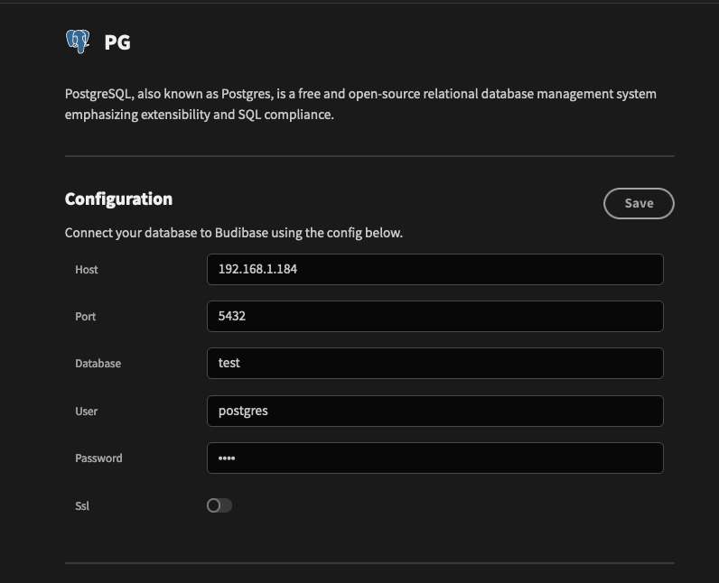
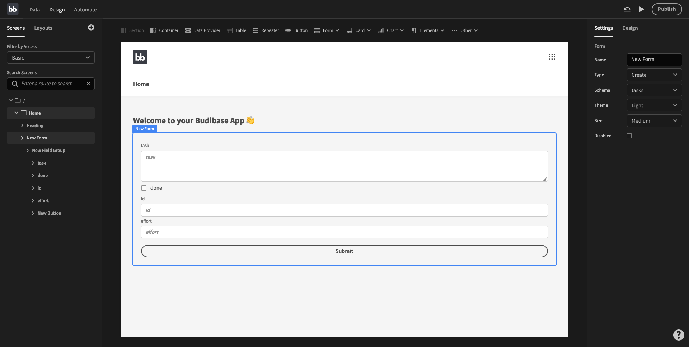

# "Plus" Datasources

> **Plus datasources allow external databases to act like the Budibase Internal Database.**


The only 2 "plus" datasources in budibase at this time are Postgres and MySQL. 

We will add many more in future. If you would like to request a datasource, you can raise this in our github discussions community.


## Demo

Here's a quick video showing you how to set up a CRUD application in Budibase with a postgres database, in **less than a minute**.

[https://www.loom.com/share/0db5b9ba790d4b0b925eed6d0933b20b](https://www.loom.com/share/0db5b9ba790d4b0b925eed6d0933b20b)

## This looks great! How do I use it?

There are 3 steps to implementing full CRUD with a plus datasource in budibase.

#### Step 1: Connect to Your Datasource 

You can set up a connection to your datasource in exactly the same way as you may have done in the previous section:



See below for an example as used in the video. You will need to replace the configuration below with all the relevant information for **your** database.

#### Step 2: Fetch the tables from your datasource

Next, click the **Fetch Tables from Database** button to fetch the tables from your database. These tables will be shown in the UI on both the left hand panel and in the datasource configuration panel in the middle.

#### Step 3: Use the tables in your UI

You can now use the tables in [Data Providers,](../../design/handling-data/#overview) and [Forms](../../design/forms/), the same way that you can with internal tables. This will write data directly into your SQL table when you interact with your budibase app!

## 

