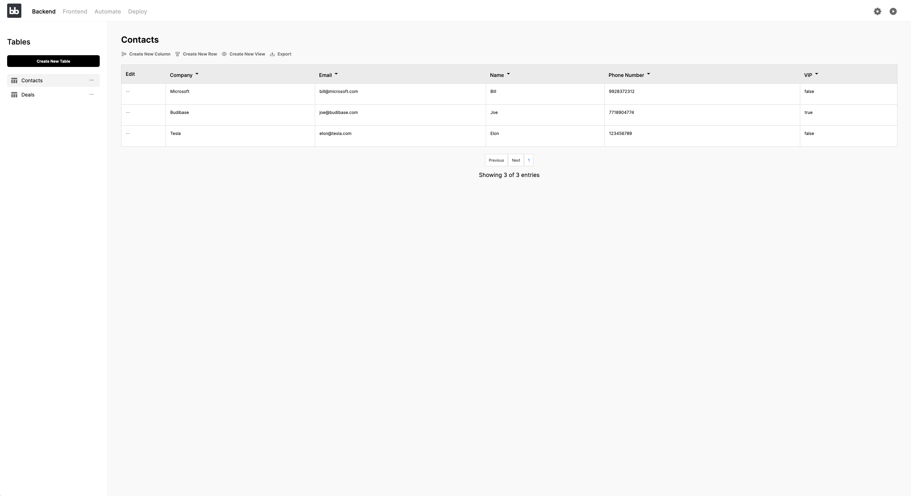

# Introduction to Data

Budibase's Data section is often described as the backend builder of Budibase builder. This is where you add and manage your data. Budibase apps rely on data and it is strongly advised to create your data structure before designing your web application. Your data structure will involve tables, columns, rows, and views - these are the building blocks that hold and present your data in a structured manner. 

When you first open the data section, you should begin by creating a table.  You can find out more about that in the [Table](tables/) section of the docs.

