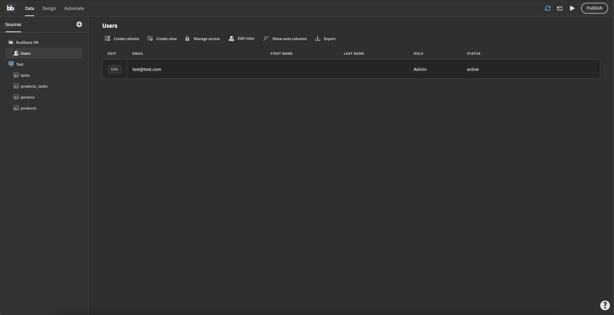
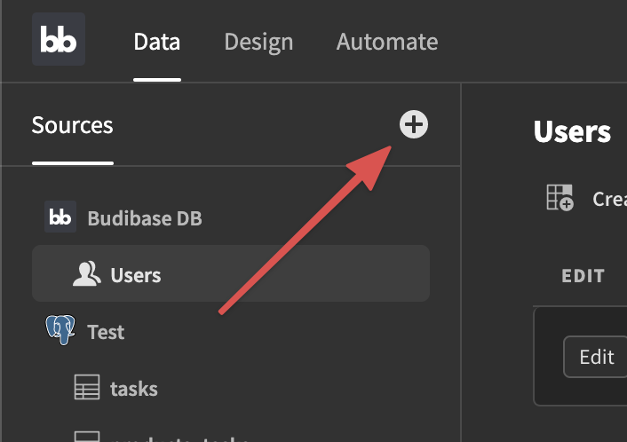

# Introduction to Data

The data section is where you add and manage your data. Budibase apps rely on data and it is strongly advised to create your data structure before designing your web application. Your data structure will involve tables, columns, rows, and views - these are the building blocks that hold and present your data in a structured manner.

## Getting started

When adding a data source in Budibase you can either create Budibase "native" sources or connect to external ones. 

To add a source, simply hit the "+" button in the top left next to the "Sources" headline.

You will be presented with a modal that shows you all the different source types you can use. In the next few pages we will take a closer look at a few of these.

You are free to mix and match sources as you like. Create an internal table, pull in some data from a Postgres database and/or connect to a REST API.

