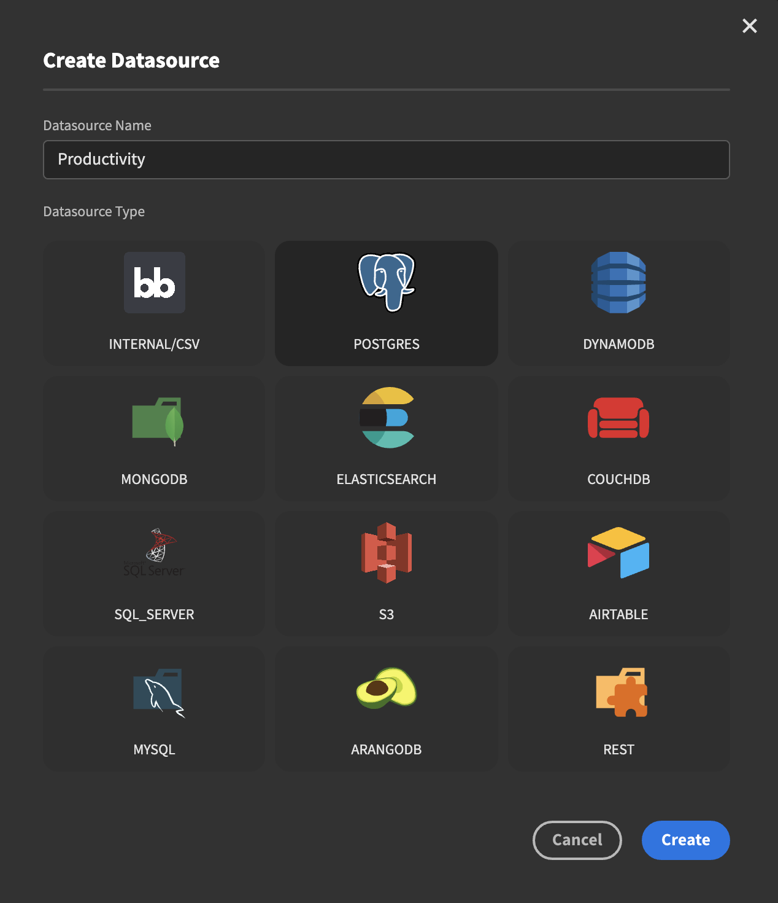
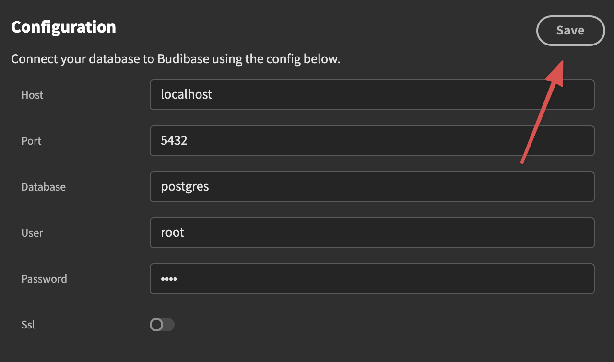
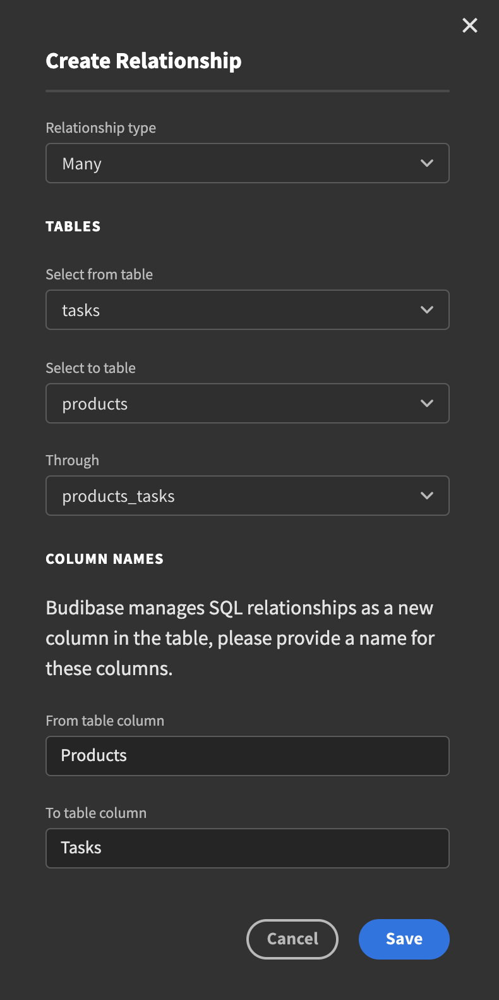
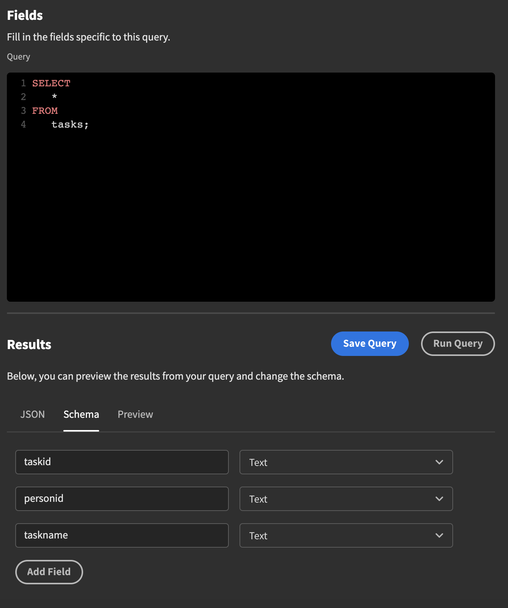

# PostgreSQL and MySQL

Most companies already have big databases that they want to pull data out of and use in their internal applications. Let's take a look at how we can connect to one.

### Connecting to the database server

We will start by creating a new datasource. Click the `+` button next to the sources heading in the sidebar on the left. Enter a name for your connection and select the SQL source of your choice. In the example below we'll be using Postgres. 

Once created you will be presented with a new screen. where you will have to enter your connection information.   Enter the relevant information; host, port, database name as well auth information. Once you're done. Hit Save. If successful you will get a notification confirming that your datasource has been updated. 

### Fetching tables

To fetch the tables from your database click the `Fetch tables from database`button. You will be presented with list of all the tables. Before veturing forth, update the display columns so that they make sense by clicking the button.

###  Creating relationships

To help Budibase understand your database you will need to create the relationships. In our example we have products that are related to our tasks via many-to-many relationship. Let's take a look at how something like that would look:

Through/join tables are only for many-to-many relationships in SQL.

If you have a direct mapping of 1:N with a foreign key you do not need a through table if you have a foreign key. To set up a relationship select `One` and link to the other table.  Select the foreign key.

### Writing your own Query

There are situations where you need more than a simple CRUD interface. In order to around that we also have the  ability to write our own SQL queries. To get started, hit the `Add query` button. On the next page you will have to enter a name for the query as well as select the function you want to perform and last but certainly not least, enter your actual actual SQL.

After writing your query, hit the run query button. If successful you will be presented with a JSON schema. Click the Schema button and select the appropriate data types for the different fields. When you are satisfied with the query, hit `Save Query`.

