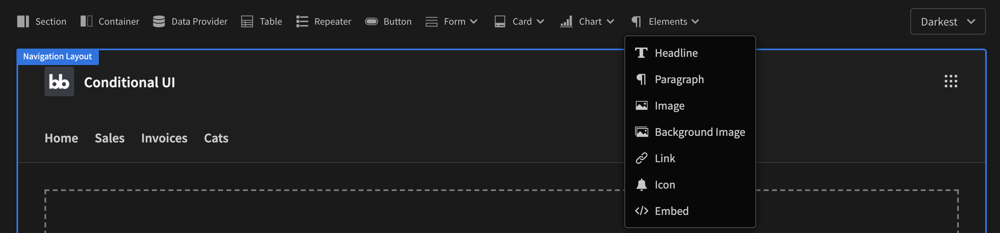

# Components

Components are the building blocks of Budibase. They are used to construct your user interface. At budibase we use the Spectrum design system created by Adobe. This gives you a great out-of-the-box experience where things just work. As a plus you also get themes by default.

There are a number of components in Budibase. They can be found along the top of the preview window in the Design section.

Here's a list of links to the current components that are available:

* [Section](section.md)
* [Container](container.md)
* [Data Provider](data-provider.md)
* [Repeater](repeater.md)
* [Forms](../forms/)
* [Table](table.md)
* [Chart](charts.md)
* [Card](card.md)
* [Text](text.md)
* [Button](button.md)
* [Icon](icon.md)
* [Image](image.md)
* [Embed](embed.md)

