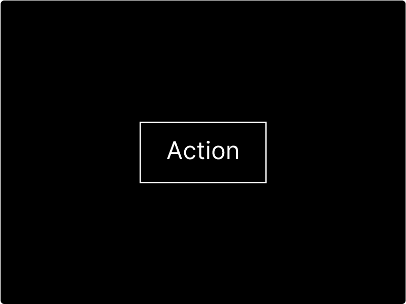

# Button

Use the button component to encourage users to take actions, and make choices, with a single click or tap. The  Button component requires text and an action.

## How to add a Button:

To add a Button to your designs:

* [ ] Click the `Button` button

## How to style your Button

The Button component is versatile and can accept updates from all of the [design properties](). Once you have finished the initial design, you should [enhance your button with a Hover and Active class →](../states.md). 

## Adding actions to your Button

Within the setup panel, you can [give your Button actions →](../actions.md).

