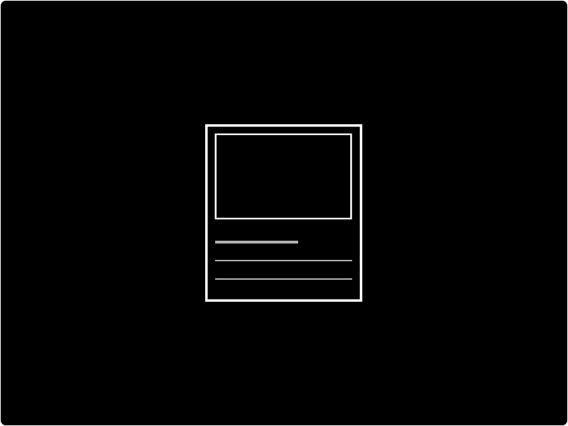

# Card

Use the Card component to display data from your tables to your users in a structured, repetitive manner. Cards contain content and in some cases images and actions about a single subject. There is currently two types of Card component; vertical and horizontal. 


Important!   
If you select the [Repeater](repeater.md) component, select a table, and add the Card component to it, you can generate multiple cards at once.


## How to add a new Card

To add a new Card to your designs:

* [ ] Click the `card` button
* [ ] Select the card type you would like to add

## How to display data from your tables as Cards 

* [ ] Click the layout dropdown, and select the [`Repeater`](repeater.md) component
* [ ] Link your  [Repeater](repeater.md) component to the Table which contains the data you would like to display
* [ ] Click the Card component dropdown, and select a Card type
* [ ] In the Card's Setup panel, [bind](../binding.md) your data from your Tables to your Card component using the ✎ icon.

## How to style your Card

There are 2 types of Cards within Budibase. Each Card has its own unique settings. The Card component can also accept some style updates from the Design panel i.e `Background - Gradient: Heavy Rain`:

### Vertical

The Vertical Card is structured in a vertical manner - items are stacked on top of each other.

The Vertical Card component comes with the following settings:

| Setting | Description |
| :--- | :--- |
| Name | Change the name of the component |
| Image | Add an image to your Card |
| Heading | Add a heading to your card, directly under the image |
| Description | Add a description to your card, directly under the heading  |
| Link Text | Add the text of your link to your card, directly under the description  |
| Link URL | Activate your link with a URL |
| Link Color | Change the color of your link |
| Hover Color | Change the hover color of your link |
| Image Height | Set your image's height \(in rem\) |
| Card Width | Set the width of your Card |

### Horizontal

The Horizontal Card is structured in a horizontal manner - items are stacked alongside each other.

The Horizontal Card component comes with the following settings:

| Setting | Description |
| :--- | :--- |
| Name | Change the name of the component |
| Image | Add an image to your Card |
| Heading | Add a heading to your card, directly under the image |
| Description | Add a description to your card, directly under the heading  |
| Subtext | A muted text which sits underneath your description. |
| Link Text | Add the text of your link to your card, directly under the description  |
| Link URL | Activate your link with a URL |
| Link Color | Change the color of your link |
| Hover Color | Change the hover color of your link |
| Image Width | Set your image's width \(in rem\) |
| Card Width | Set the width of your Card |
| Card Height | Set the height of your Card |

