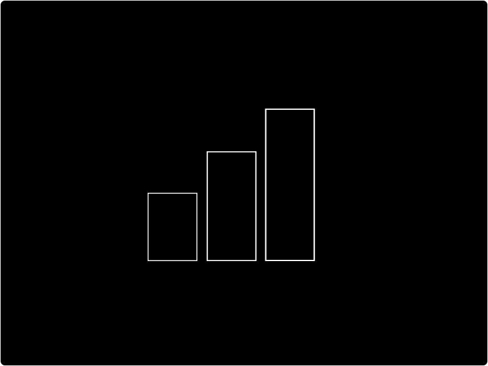

# Chart

Use the Chart component to display data from your tables to your users in a visually pleasing manner. The chart components pull in two types of values from your Tables; an X value and a Y value. The data within the column linked to the Y-axis must be a ['Number' \(data type](../../data/tables/columns.md)\).

## How to add a new Chart

To add a new form to your designs:

* [ ] Click the `chart` button
* [ ] Select the chart type you would like to add

## How to style your Chart

There are 4 types of charts within Budibase and they all have different settings and data requirements:

### 

### Donut Chart

The Donut Chart \(also known as Doughnut chart\) is a variation on a Pie chart except it has a round hole in the center which makes it look like a donut, hence the name.

The Donut Chart component comes with the following settings:

| Setting | Required | Description |
| :--- | :--- | :--- |
| Name | Yes | Change the name of the component |
| Table | Yes | Choose a table to link your chart to |
| Name Field | Yes | Select the column would you like to set as your categories |
| Value Field | Yes | Select the column you would like to display as your values \(must be a number data type\) |
| Animate chart | No | Tell your chart to load in an animated fashion |
| Hover highlight | No | Tell your chart to display the relevant value when the user hovers |
| Keep last hover | No | Tell your chart to continue to present the last value hovered  |
| Colors | No | Select different color palettes |
| Legend width | No | Control the width of the accompanying legend |

### 

### Bar Chart

The classic Bar Chart uses either horizontal or vertical bars \(column chart\) to show discrete, numerical comparisons across categories. One axis of the chart shows the specific categories being compared and the other axis represents a value scale.

The Bar Chart component comes with the following settings:

| Setting | Required | Description |
| :--- | :--- | :--- |
| Name | Yes | Change the name of the component |
| Table | Yes | Choose a table to link your chart to |
| Name Field | Yes | Select the column would you like to set as your categories |
| Value Field | Yes | Select the column you would like to display as your values \(must be a number data type\) |
| Y-Axis Label | No | Add a label to your Y-Axis |
| X-Axis Label | No | Add a label to your X-Axis |
| Colors | No | Select different color palettes for your bars |
| Gradients | No | Select different gradients palettes for your bars |
| Highlight single bar | No | Highlight a bar when hovered |
| Width | No | Give your chart a width |
| Height | No | Give your chart a height |
| Horizontal | No | Transform your vertical bar chart to a horizontal bar chart |

### 

### Line Chart

A line chart \(also known as a line plot or line graph\) is a chart that uses lines to connect individual data points that display quantitative values over a specified time interval. The Line Chart component comes with the following settings:

| Setting | Required | Description |
| :--- | :--- | :--- |
| Name | Yes | Change the name of the component |
| Table | Yes | Choose a table to link your chart to |
| Name Column | Yes | Select the column would you like to set as your categories |
| Value Column | Yes | Select the column you would like to display as your values \(must be a number data type\) |
| Date  | Yes | Select the column you would like to display as your dates \(must be a data/time data type\) |
| Colors | No | Select different color palettes for your bars |
| Line Curve | No | Set how you would like the line curve displayed |
| X-Axis Value Type | No | Select between data and number |
| Grid | No | Dictate the direction of the grid |
| Y-Axis Label | No | Add a label to your Y-Axis |
| X-Axis Label | No | Add a label to your X-Axis |
| Show All Datapoints | No | Select to highlight data points on your chart |
| Width | No | Give your chart a width |
| Height | No | Give your chart a height |
| Is Animated | No | Tell your chart to load in an animated fashion |
| Locale | No | Select between a UK and US locale format |
| X-Axis Value Type | No | Select between a number and date format |
| X-Axis Format | No | Select your date format |
| Tooltip title | No | Provide a title for your tooltip |
| X Ticks | No | Outline how many integers you would like along your X-Axis |
| Y Ticks | No | Outline how many integers you would like along your Y-Axis |

### 

### Grouped Bar Chart

| Setting | Required | Description |
| :--- | :--- | :--- |
| Name | Yes | Change the name of the component |
| Table | Yes | Choose a table to link your chart to |
| Group Column | Yes | Select the column you would like to use to group your bars |
| Name Column | Yes | Select the column would you like to set as your categories |
| Value Column | Yes | Select the column you would like to display as your values \(must be a number data type\) |
| Colors | No | Select different color palettes for your bars |
| Width | No | Give your chart a width |
| Height | No | Give your chart a height |
| Grid | No | Dictate the direction of the grid |
| Y Ticks | No | Outline how many integers you would like along your Y-Axis |
| Is Animated | No | Tell your chart to load in an animated fashion |
| Is Horizontal | No | Transform your vertical grouped bar chart to a horizontal grouped bar chart |
| Tooltip Title | No | Provide a title for the chart's tooltips \(hover over bars to see\) |

