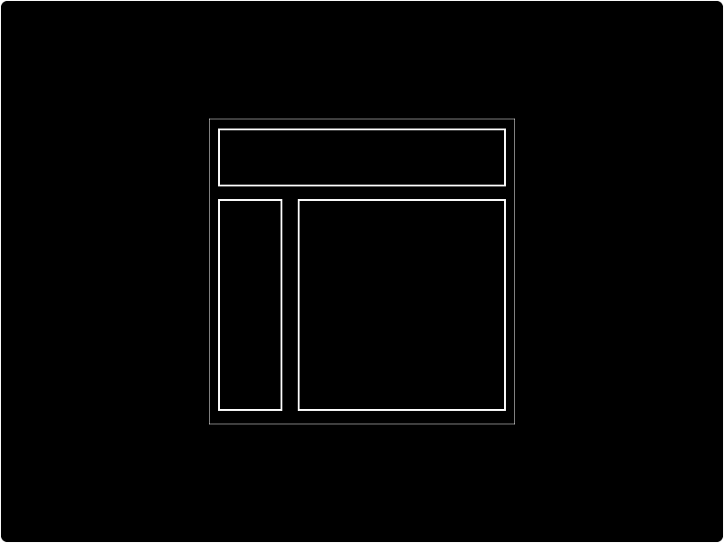

# Container

A Container is a `Div` with pre-defined styles. They are the building blocks of your application and critical for responsive design. Containers are used to structure your application and to contain other elements in a structured way. An analogy that may help your understanding is to think of Containers as picture frames hanging on a gallery wall \(your application\). 

## How to add a Container

To add a new Container to your designs:

* [ ] Click the `container` button

## How to style a Container

You can style your container using the Design panel. All the Design properties are applicable apart from the typography section. 

