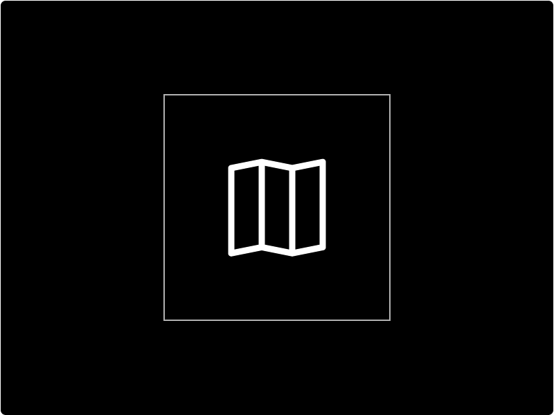

# Embed

The Embed component is used to embed content into your web application.  This content is provided by an external application or other sources of interactive content such as a browser plug-in. Types of content can range from SVGs, PDFs, Maps, to web pages.


[Clickjacking](https://en.wikipedia.org/wiki/Clickjacking) is one kind of common iframe attack where hackers embed an invisible iframe into your document \(or embed your document into their own malicious website\) and use it to capture users' interactions. This is a common way to mislead users or steal sensitive data.


