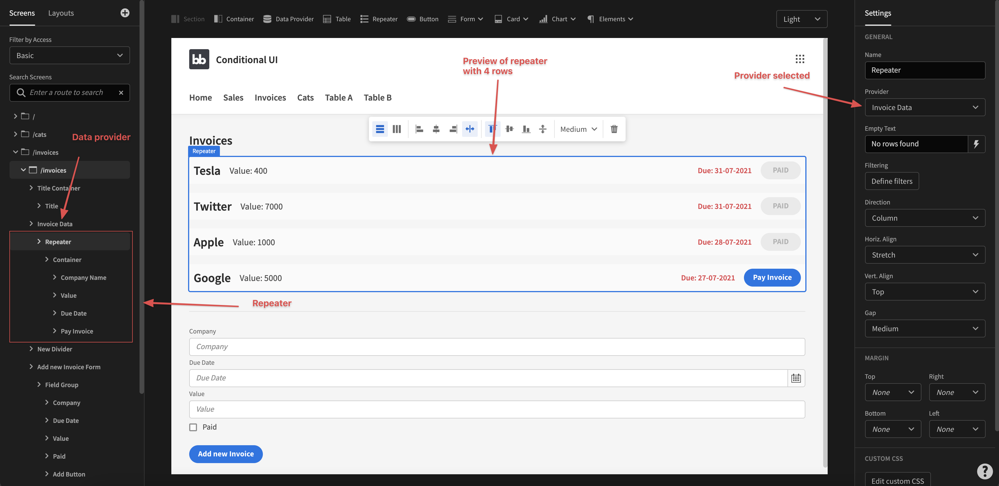

# Repeater

The repeater component is used to loop over your data. Every child of your repeater will thus be repeated for every row in the data provider that you have selected.

To get started with it, add it as a child to a [data provider](data-provider.md) and in the settings, select the data provider. You can then add your components and get started. An example structure can be seen below:

