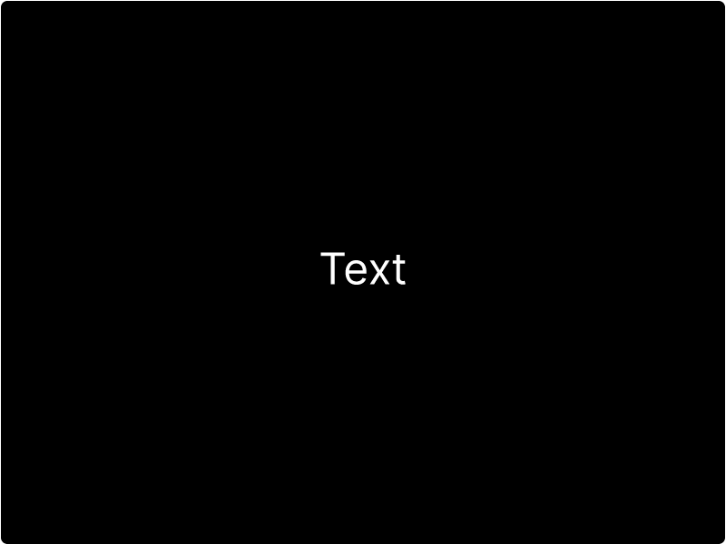

# Text

Use the Text component to display Text. The Text component is versatile and can be styled using the Design panel. The Text component comes in two types: Heading and Paragraph. They both share the same settings. Both Text components can be bound to data in your Tables when used with the Repeater component.

## How to add Text

To add Text to your designs:

* [ ] Click the `text` button
* [ ] Select the Text type you would like to add

## How to style Text

Within the Design panel, you will find the Typography section. You can style your text using the available properties.

