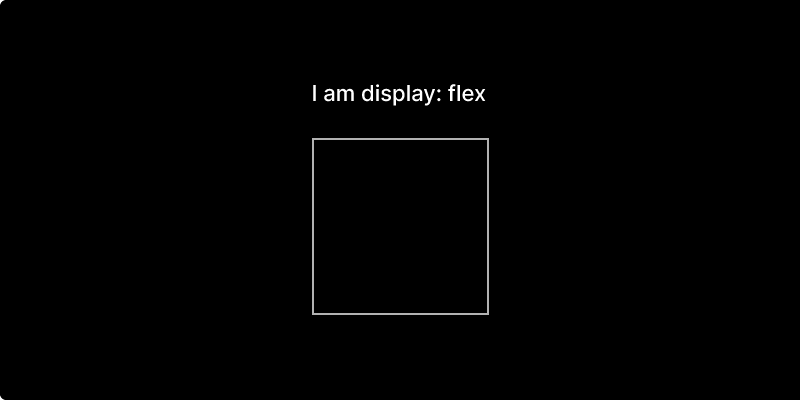

# Layout

The Layout design properties revolve around Flexbox. The Flexible Box Layout Module, makes it easier to design flexible responsive layout structure without using float or positioning. It is commonly known by the shorthand 'Flex'. 

## Properties:

The Layout section comes with the following settings:

### Display

The **`display`** property sets whether an element is treated as a [block or inline element](https://developer.mozilla.org/en-US/docs/Web/CSS/CSS_Flow_Layout) . This is a critical element of responsive design.



The Flex display property behaves like a block.




The Inline Flex display property behaves like an inline block.

 



#### 

### Flex-direction















R



## Helpful resources:





