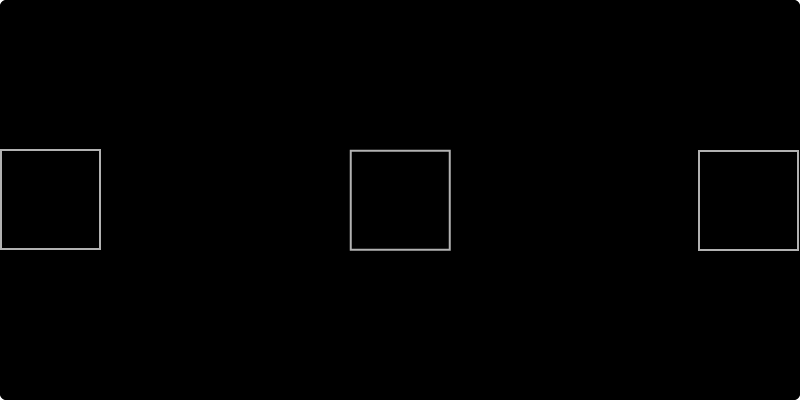
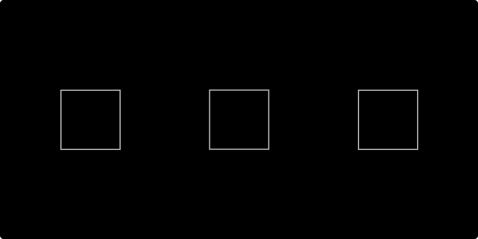
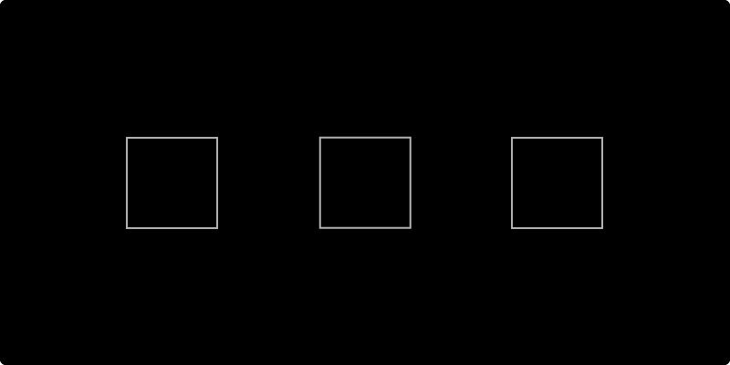
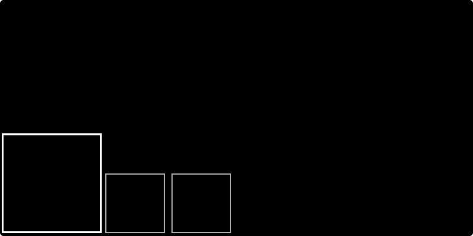
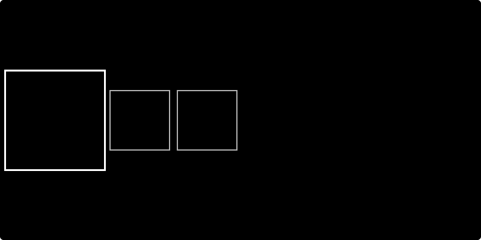
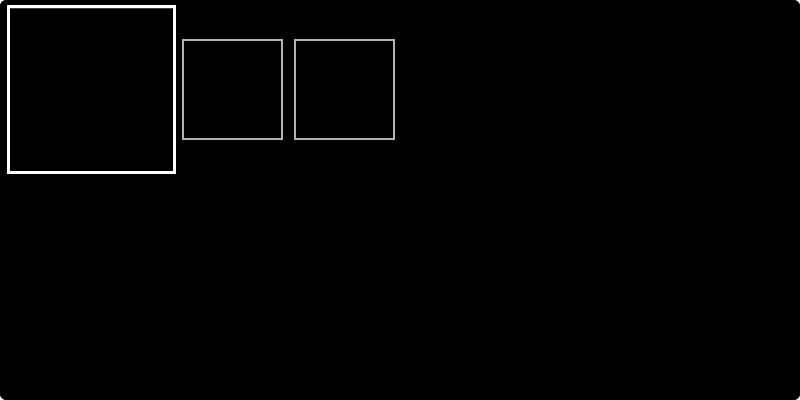
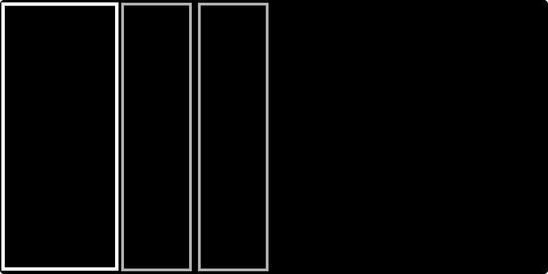
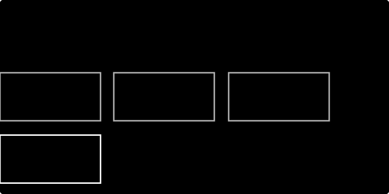
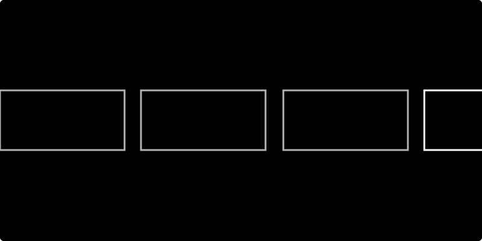

# Layout

The Layout design properties revolve around Flexbox. The Flexible Box Layout Module makes it easier to design flexible responsive layout structures. It is commonly known by the shorthand 'Flex'. 

## Properties:

The Layout section comes with the following settings:

### Display

The **`display`** property sets whether an element is treated as a [block or inline element](https://developer.mozilla.org/en-US/docs/Web/CSS/CSS_Flow_Layout). This is a critical element of responsive design.



The Flex display property behaves like a block.




The Inline Flex display property behaves like an inline block.




### 

### Flex-direction

The [flex-direction](https://yoksel.github.io/flex-cheatsheet/#section-flex-direction) property specifies how [flex items](https://www.w3.org/TR/css-flexbox-1/#flex-item) are placed in the flex container, by setting the direction of the flex container’s [main axis](https://www.w3.org/TR/css-flexbox-1/#main-axis). This determines the direction in which flex items are laid out.



Display objects in a row. 




Same as row, but reversed.




Display objects in a column. 




Same as column, but reversed.




### Justify-content \(horizontal alignment\)

The [justify-content](https://yoksel.github.io/flex-cheatsheet/#section-justify-content) property dictates how objects are spaced out along a column or row. 



[Flex items](https://www.w3.org/TR/css-flexbox-1/#flex-item) are packed toward the start of the line. 




[Flex items](https://www.w3.org/TR/css-flexbox-1/#flex-item) are packed toward the end of the line.




[Flex items](https://www.w3.org/TR/css-flexbox-1/#flex-item) are packed at the center of the line.




[Flex items](https://www.w3.org/TR/css-flexbox-1/#flex-item) are evenly distributed in the line.




[Flex items](https://www.w3.org/TR/css-flexbox-1/#flex-item) are evenly distributed along the line, with half-size spaces on either end.




Flex-items are evenly distributed with a full-size space on either end




### Align-items \(vertical alignment\)

The **`align-items`** property sets the default alignment for the objects within the container.



Flex items are packed toward the start of the flex container.




Flex items are packed toward the end of the flex container.




Flex items are packed toward the center of the flex container.




Flex items are aligned such that their [flex container baselines](https://drafts.csswg.org/css-flexbox-1/#flex-baselines) align.




[Flex items](https://www.w3.org/TR/css-flexbox-1/#flex-item) are evenly distributed along the line, with half-size spaces on either end.




### Wrap

The **`flex-wrap`** property sets whether flex items are forced onto one line or can wrap onto multiple lines.



Flex items break into multiple lines. A must-have for responsive design. 




Flex items are laid out in a single line which may cause the flex container to overflow.




### Gap

The gap property sets the gaps \(gutters\) between rows and columns. It is a shorthand for row-gap and column-gap. It's a great property for spacing and comes in handy when working with the repeater.


The Gap property does not render in the Budibase builder but does in your application and in preview mode. This is due to Electron using an old version of Chrome -  the Gap property is new to Chrome. 


## Helpful resources:







