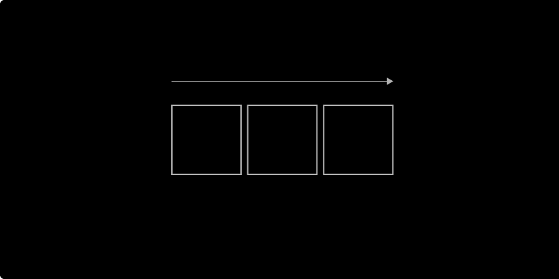
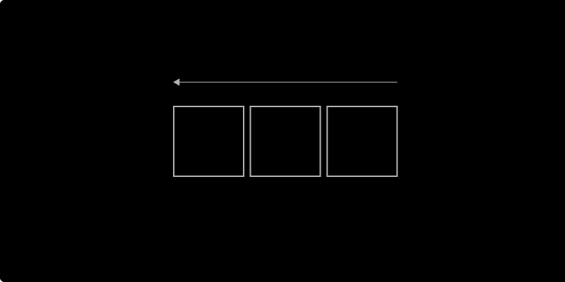
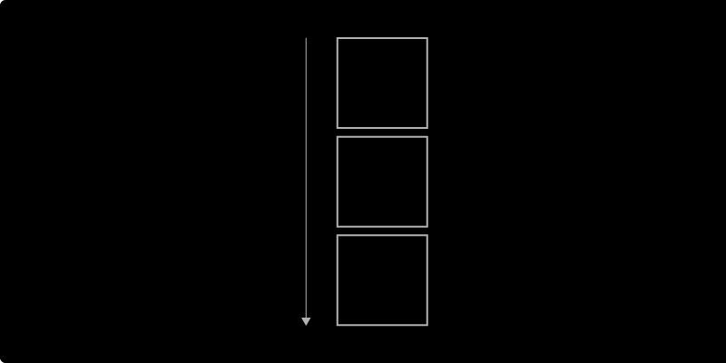
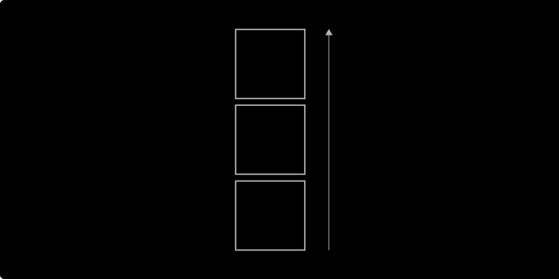
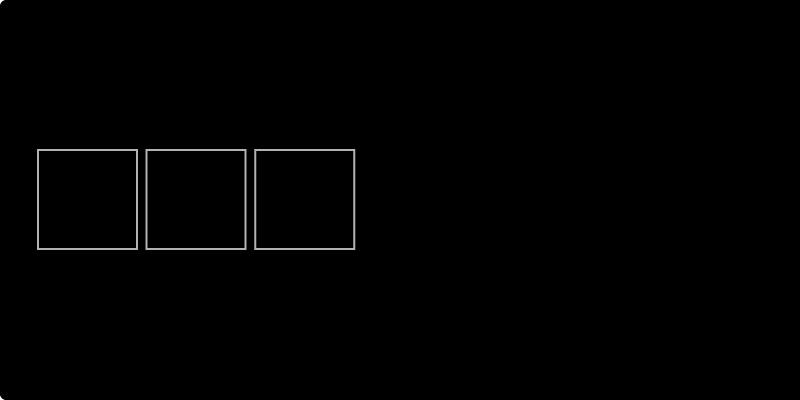
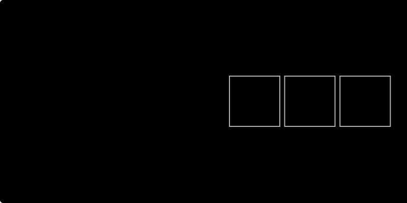
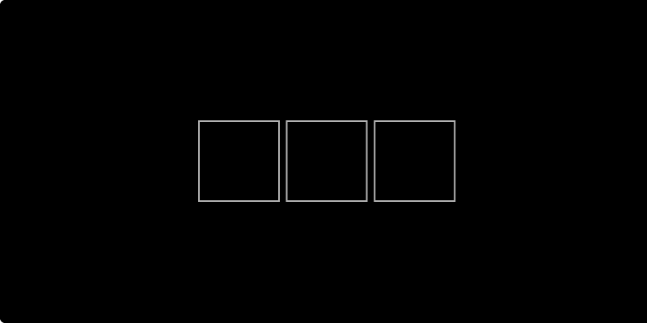

# Layout

The Layout design properties revolve around Flexbox. The Flexible Box Layout Module makes it easier to design flexible responsive layout structures. It is commonly known by the shorthand 'Flex'. 

## Properties:

The Layout section comes with the following settings:

### Display

The **`display`** property sets whether an element is treated as a [block or inline element](https://developer.mozilla.org/en-US/docs/Web/CSS/CSS_Flow_Layout). This is a critical element of responsive design.



The Flex display property behaves like a block.




The Inline Flex display property behaves like an inline block.




### 

### Flex-direction

The [flex-direction](https://yoksel.github.io/flex-cheatsheet/#section-flex-direction) property specifies how [flex items](https://www.w3.org/TR/css-flexbox-1/#flex-item) are placed in the flex container, by setting the direction of the flex container’s [main axis](https://www.w3.org/TR/css-flexbox-1/#main-axis). This determines the direction in which flex items are laid out.



Display objects in a row. 




Same as row, but reversed.




Display objects in a column. 




Same as column, but reversed.




### Justify-content 

The [justify-content](https://yoksel.github.io/flex-cheatsheet/#section-justify-content) property dictates how objects are spaced out along a column or row. 



[Flex items](https://www.w3.org/TR/css-flexbox-1/#flex-item) are packed toward the start of the line. 




[Flex items](https://www.w3.org/TR/css-flexbox-1/#flex-item) are packed toward the end of the line.




[Flex items](https://www.w3.org/TR/css-flexbox-1/#flex-item) are packed at the center of the line.




## Helpful resources:







