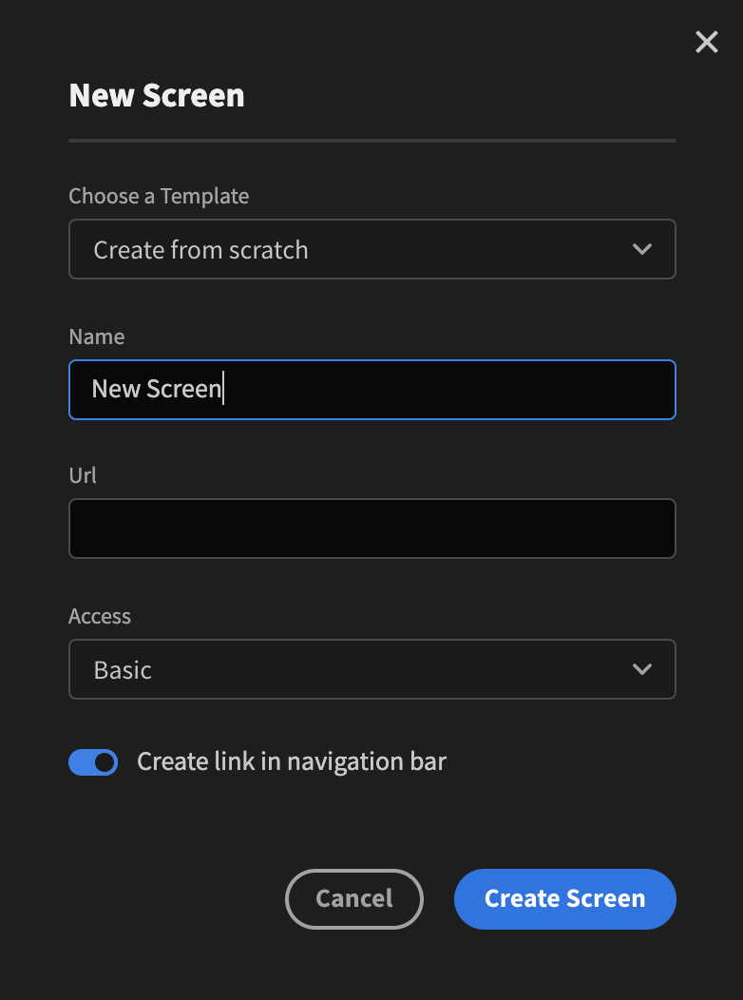

# Screens

A screen in Budibase corresponds to a single page. They are either auto-generated \(when you create an internal table/csv import\) or you can create them manually. To do so hit the `+` button in the corner, next to the Screens title.

You can pick from a ready-made template that corresponds to your internal data tables or create from scratch. Enter the relevant details as well as pick what access level you want for the screen. Hit the `Create Screen` button. You will now have a blank canvas that you can add components to.

