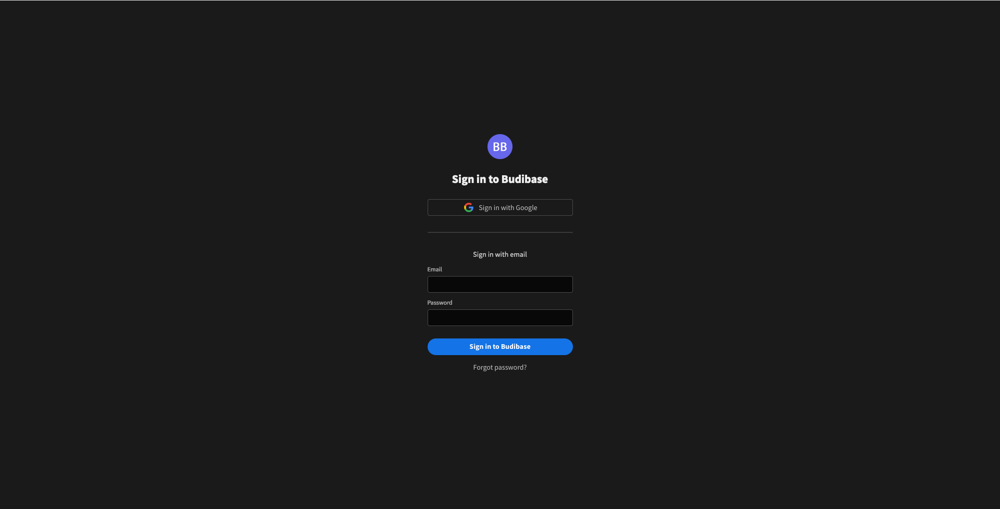
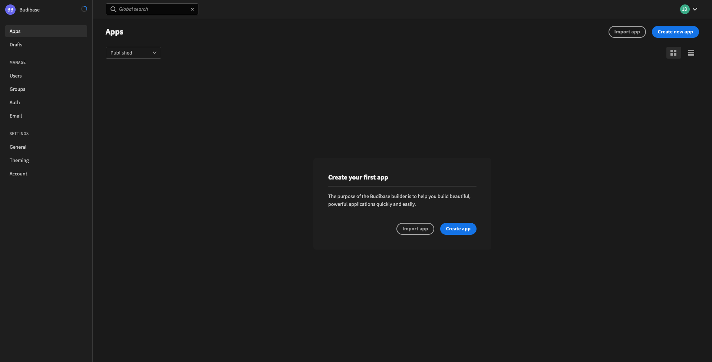

# Getting Started

## Self Hosting Budibase

Budibase is open source, self hosted software. 

You only have to set up your budibase instance **once**. Once your instance is up and running, other members of your team can build and interact with budibase simply by accessing the URL that you have hosted your budibase instance on.

## Prerequisites

To complete this guide, you must have docker and docker compose installed on your machine. Follow the instructions for downloading docker for [Windows](https://docs.docker.com/docker-for-windows/install/), [Mac](https://docs.docker.com/docker-for-mac/install/), and [Linux](https://docs.docker.com/engine/install/ubuntu/) machines.


Docker is a platform that makes it much easier to automate  the running of software programs. It allows us to provide a smooth and consistent budibase experience across all the major operating systems.


### Linux post install

For those setting up docker/docker-compose in a Linux environment it is worth checking that your permissions are setup correctly before attempting to continue - more details about this can be found [here in the docker documentation](https://docs.docker.com/engine/install/linux-postinstall/).

## Choose an Installation Method


There are several ways to set up budibase. Please choose the best one suited for you!


### I'm not comfortable with the command line, Docker or NodeJS.

We do not generally recommend self-hosting software and managing your own infrastructure if this is the case. We are currently working on a hosted cloud sandbox that will allow users to use budibase in their browser without any setup or self-hosting.

However, the simplest way to get budibase up and running until then is to use our **one click** digitalocean installation. This will create your very own self hosted budibase installation running in digitalocean, without any configuration at all.



### \(Recommended\) I want to run and manage budibase with the Budibase CLI.

The budibase CLI provides the tools you need to set up, update and manage your budibase installation.

Follow the guide below to install it. You can install the CLI with NPM, or you can download one of the binaries we provide instead.



### I just want to run and manage budibase myself using Docker.


We do recommend the Budibase CLI setup for production installations, as it contains features that allow you to easily update your cluster and manage all aspects of your budibase installation.


If you don't want to install NodeJS or the CLI and just want to jump in with the `docker-compose` files and run budibase yourself using docker, you can follow the guide below.



## Post Install

Your budibase installation should now be up and running. Go to the URL of your new installation to start using budibase!

### Creating Your Admin User

Every budibase installation must have an **admin user**. This user is responsible for the administration of the budibase installation, and has total control over all aspects of budibase. Enter the admin and password for your admin user, and click "Create admin user".


You will then be asked to log in with your new admin user.



After you log in, you will be taken to the budibase **portal.** The portal is where budibase users manage their apps, configuration settings, and much more.

### Creating Your First App

The basic budibase setup is now complete. You have reached the summit of this mountain, and the end of this guide. You can now create your first budibase app by following the prompt on screen. You can find information about building apps with budibase throughout the rest of the budibase documentation.



There are a few things however, that will enhance your budibase experience.

#### SMTP/Email Configuration

Set up email/SMTP [here](../admin/email.md).

#### \(Advanced\) Reverse Proxy Configuration

Set up NGINX to sit in front of your budibase installation [here](../self-hosting/advanced-options/reverse-proxy.md).

## Managing Your Budibase Installation

### Updating Budibase

If you want to receive those sweet, sweet updates. You can update your budibase installation using the budibase CLI. Simply run the following to get the latest and greatest.

```bash
budi hosting --update 
```

