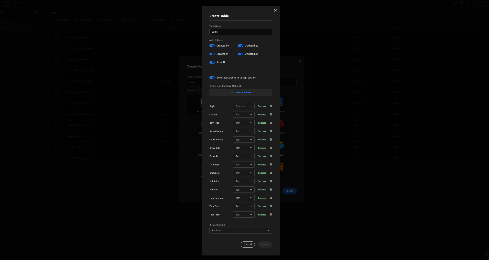
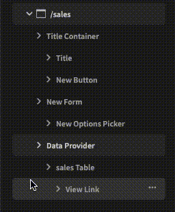
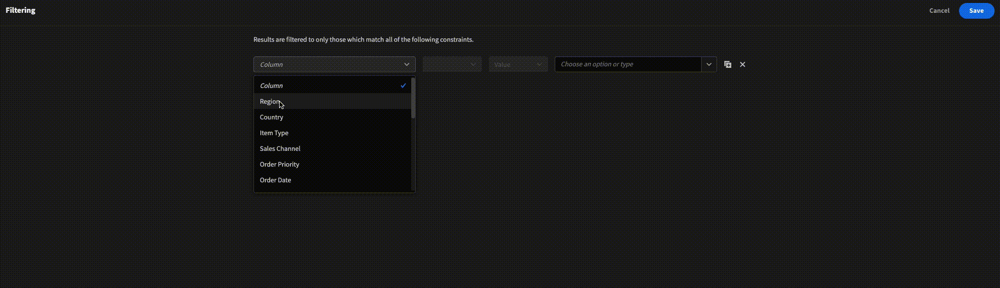

# Add a filter to a table

Dropdown filters are a common way to filter data that's usally displayed in a list. By selecting an option from the dropdown filter, the data within the list updates to only show records that match with your selection. Adding a dropdown filter is a similar process to [adding search to a table](add-search-to-a-table.md).

### Prerequisites

For Search to work, you need data. You may already have data, but if you don't you can use the data within the Sales CSV below. 

When creating your new table in the data section, call it Sales. When uploading the CSV, please change the Region data type to Options \(This is what we will use to filter our data\).



## Guide

After uploading the data above, Budibase autogenerated us 3 screens in the design section. Our table was called Sales, so our screens are:

* /sales/
* /sales/:id
* /sales/row/new

### Steps

* [ ] Click on the /sales/ screen
* [ ] Add the `Form` component
* [ ] In the settings panel, under Schema, select your table
* [ ] Move the new `Form` component above the `New Data Provider` component
* [ ] Add a `Options Picker` component and make sure it is nested under the `Form` component
* [ ] In the settings panel, under 'Field', select the field you would like to filter \(in our case, it's 'Region'\) and then add a placeholder \(for those using the CSV above, I used 'Filter region' for my placeholder\)
* [ ] In the navigation tree, move the `New Data Provider` component underneath our `New Options Picker` component

* [ ] In the settings panel for the `New Data Provider` component, click the Define Filters button
* [ ] Click add filter
* [ ] Select the column you would like to search \(in our case, Region\)
* [ ] Select the value dropdown, and select Binding
* [ ] Click the lightning bolt on the last input 
* [ ] Select {{ New Form.Fields.\[\[column\]\] }}
* [ ] Click Save, and Save again

And we're done. We've successfully added a dropdown filter to a table.

