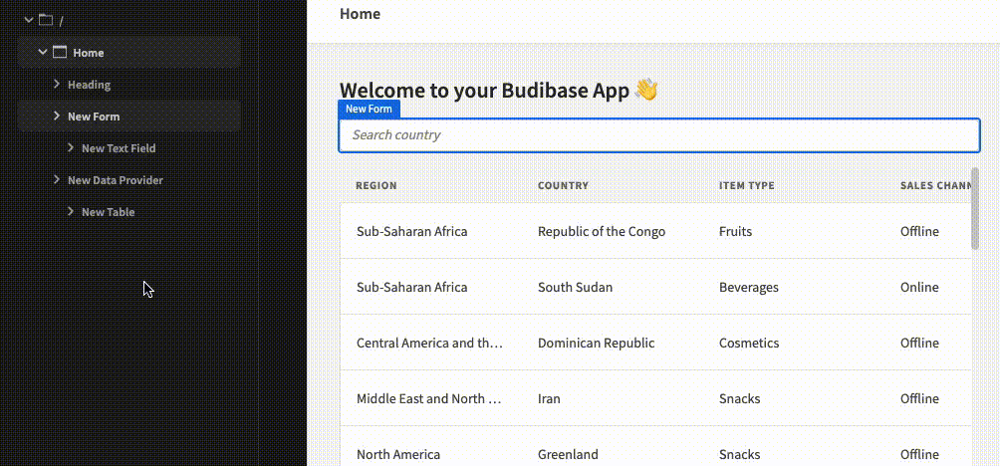
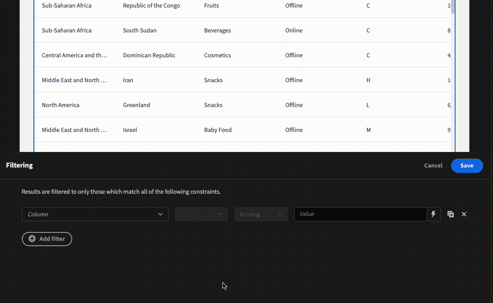
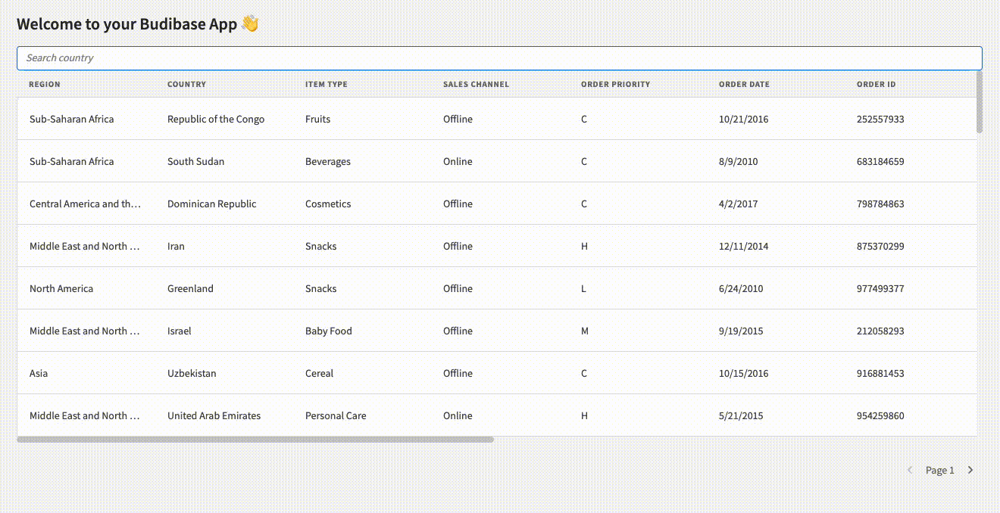
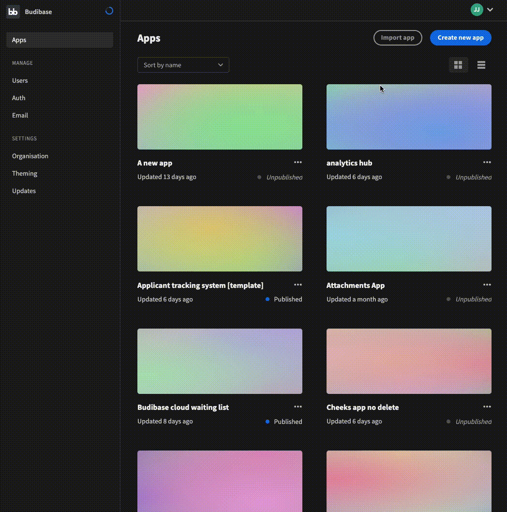

# Add search

A  search box is a common way to search data. When you search for a term inside the search box, the data within your list (usually a table or list of cards) updates to only show records that match your search query. Adding a search box is a similar process to [adding a dropdown filter to a table](add-a-dropdown-filter-to-a-table.md).

### Prerequisites

For Search to work, you need data.

For this quick demonstration, we will use the data within the CSV below. 


Sales.csv


## Guide

After uploading the data above, Budibase autogenerated 3 screens in the design section. Our table was called Sales, so our screens are:

* /sales/
* /sales/:id
* /sales/new/row

### Steps

* [ ] Click on the /sales/ screen
* [ ] Add the `Form` component
* [ ] In the settings panel, under Schema, select Custom (at the bottom)
* [ ] Move the new `Form` component above the `New Data Provider` component
* [ ] Add a `Text Field` component and make sure it is nested under the `Form` component
* [ ] In the settings panel, select the column you would like to search (in our case, it's 'Country') and then add a placeholder (for those using the CSV above, I used 'Search country' for my placeholder)
* [ ] In the navigation tree, move the `New Data Provider` component underneath our `New Text Field` component

* [ ] In the settings panel for the `New Data Provider` component, click the Define Filters button
* [ ] Click add filter
* [ ] Select the column you would like to search (in our case, Country)
* [ ] You can then select 'Equals or 'Starts with'.
* [ ] Select the value dropdown, and select Binding
* [ ] Click the lightning bolt on the last input 
* [ ] Select {{ New Form.Fields.\[\[column]] }}
* [ ] Click Save, and Save again

And we're done. We've successfully added search to a table.\

I've attached the app below if you would like to check out the final product within the Budibase builder. To do this, download the file and import it to your builder (see GIF below).


Search demo


