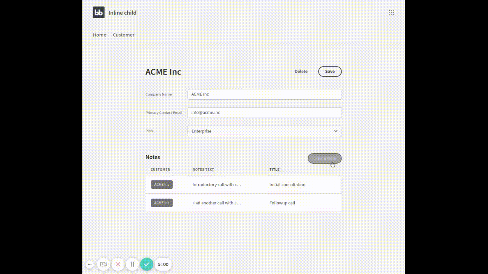

# Create a child record from the parent

In this example, we have a “Customer” record, with “Notes” attached to it. One Customer has many notes.

We will build a screen that&#x20;

1. Lists all notes for a customer.
2. Has a “Create Note” button, which allows a new note to be added via a modal&#x20;
3. Refreshes the notes list when the modal closes.

You can import my full example app to see exactly how it’s done:



Starting with a standard “Customer Detail” screen will first add the list of notes belonging to that customer:&#x20;

1. Add a new Data Provider, inside the Repeater.&#x20;
2. Set the Data property to “Repeater.Customer.Notes”. This will depend on your table and column names - i.e. “Repeater.Parent Table.Relationship Column”.&#x20;
3. Add a table to your data provider.

Next, we will build our “New Notes” modal - our child record.&#x20;

1. Add a new screen.&#x20;
2. Set the URL to `/notes/new/row/:customerid`&#x20;
3. Choose “Notes - Detail”.&#x20;
4. Click on the “Save” buttons, and “Define Action”.
5. Remove the final action for “Navigate to”.&#x20;
6. Add an action for “Close Modal”.&#x20;
7. Click on the “Save Row” action.&#x20;
8. Click “Add Column”, and choose the “Customer” column (the parent record).&#x20;
9. For its value, use `{{ URL.customerid }}` - this links to the parent customer, via the `:customerid `URL parameter.

Finally, we will add a button that will open our screen in a modal.&#x20;

1. Create a new button, and position it.&#x20;
2. Click on the “Define Actions” setting.&#x20;
3. Add the action “Navigate To”.&#x20;
4. Set the URL to your “New child” screen. You will need to pass the Parent Record’s ID into the URL. For me, It’s “/notes/new/row/{{ Repeater.Customer.\_id }}”. If you are using SQL, use your parent table’s primary key.

Now - test your app!
