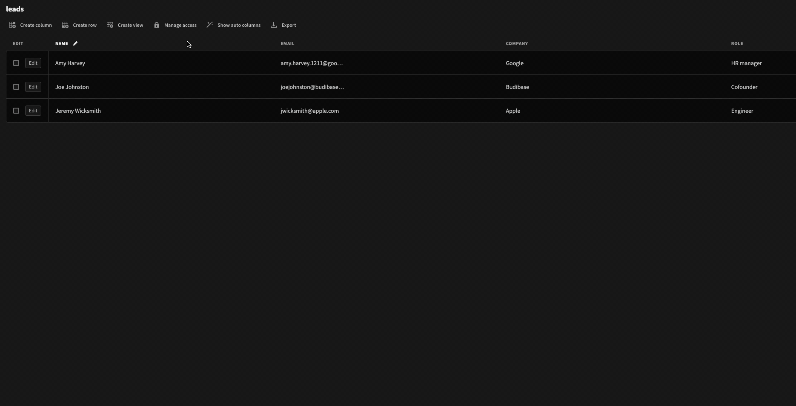
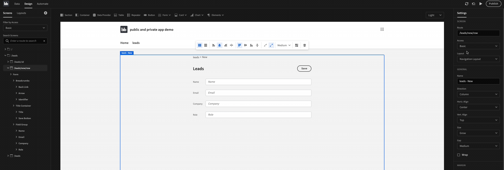
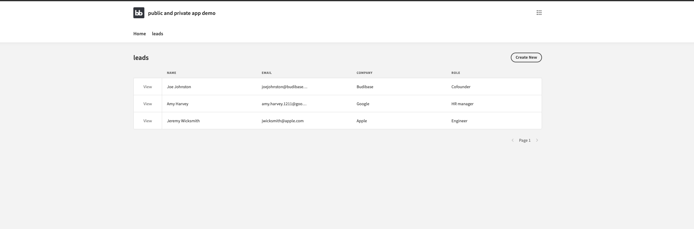

# Creating public & private screens

Quite often an application will have areas with different access levels. For example, if you are creating an applicant tracking system, you may want to create public screens to advertise jobs and collect applications, and you may also want private screens to view and manage those applications.

In this guide, we're going to create a very simple lead generation app, that will publicly collect leads and display them to us within a secure and private interface.

## Guide

* [ ] Create a new table using the Budibase DB, and upload the following CSV. If you have data, then skip to the next step.



* [ ] Click manage access
* [ ] Change read and write access to Public 

* [ ] Click on the Design tab
* [ ] Click on the screen you would like to make public - in our case: leads/new/row
* [ ] In the settings panel, select `Public` from the Access dropdown 

And now we have a public screen. In our case, public users can now access our leads/new/row screen which has our new leads form. They can also complete the form and submit it. The form requires some styling but hopefully, you now understand the concept and how to create screens based on the user's role \(public, basic, power, admin\).

Once a public user submits their information, we and other private \(basic, power, admin\) users can view the leads and their details within the private section of our app.

