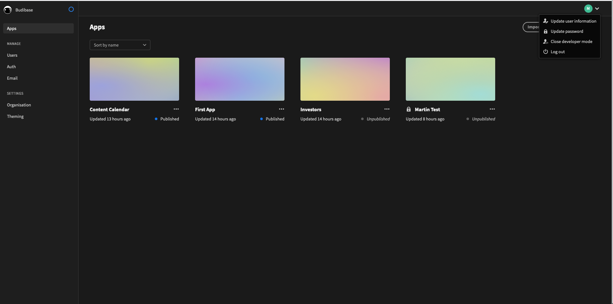
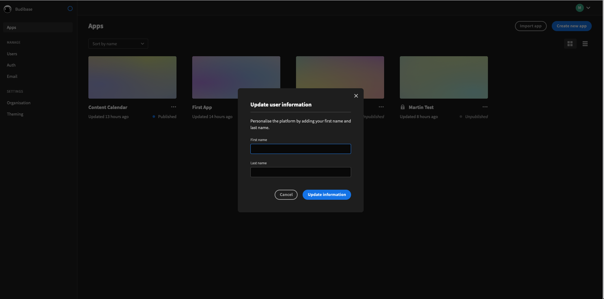
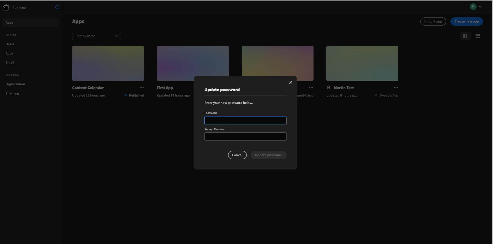

# Your User Settings

Budibase provides some options for configuring your user account. Access the user settings menu by clicking on your profile dropdown in the top right of the builder.

Let's go through the options one by one.

### Update User Information

Update your first and last name for your user account. This is useful for things like email templates within budibase, and will allow other people in your organisation to identify you. 

### Update Password

Here, you can update the password for your own user account. 

### Toggle Developer Mode \(Builder/Admin Users Only\)

As a builder/admin, you can switch between viewing the portal in **developer mode** and **standard mode**. Find out more about the different budibase portal modes.

[Find out more about the budibase portal modes.](the-budibase-portal.md)

