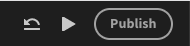
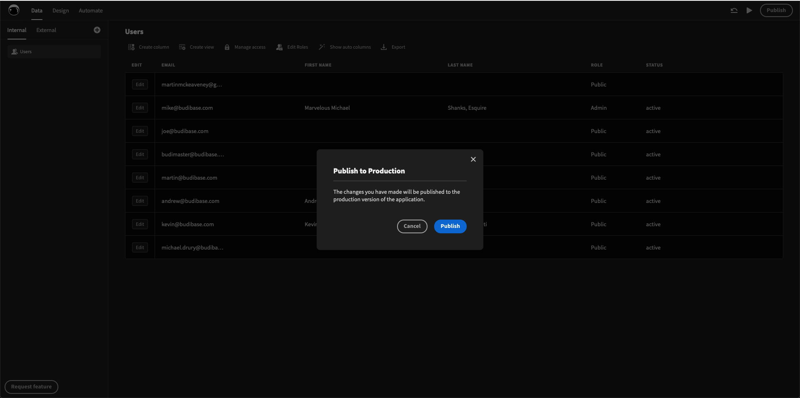
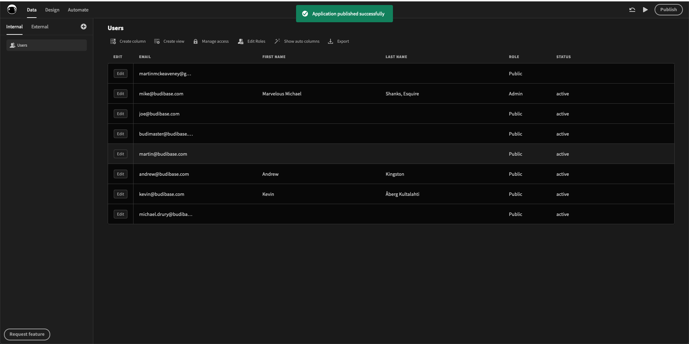
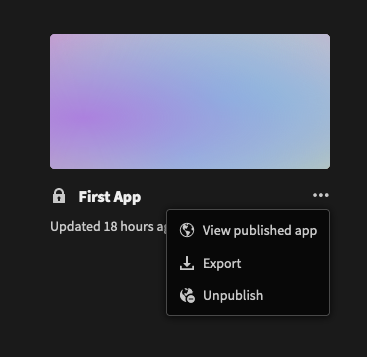

# Introduction to Publish

Publishing your web app with Budibase is simple. 

### How to publish your web app

When developing an app inside your builder, you can publish it by clicking the "Publish" button on the top right.

This will open a modal, asking you to confirm that you want to publish your app.

You will receive a notification to tell you that your app has been published successfully!

### View Your Published App

To view your newly published app, click on the app dropdown menu from the builder portal and click **View published app.**

Other users that have access to your app on your budibase installation will now have access to your published app.

### Deployment information

In the next section, [Deployment information](deployment-information.md), we cover the important information about deployment that you need to know before considering a platform to build your web apps and tools on top of. We will cover where your web apps are deployed to as well as how it works.

