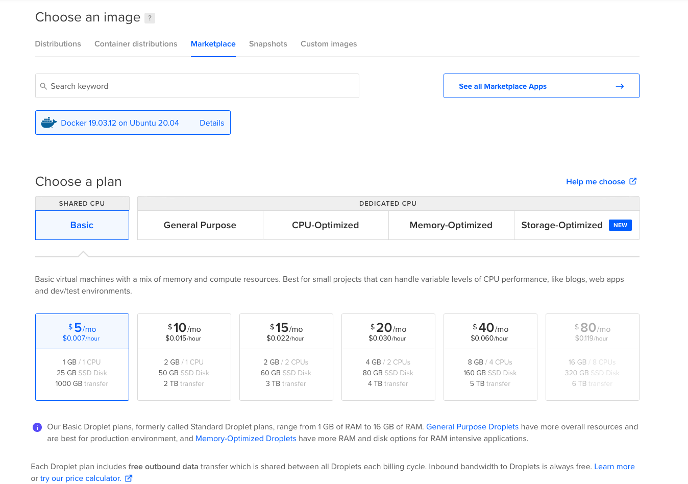
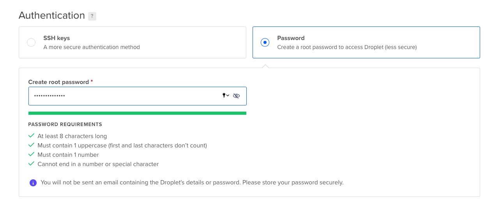

# DigitalOcean


## DigitalOcean Simple Setup

The simplest way to get self-hosted budibase up and running quickly is to use [DigitalOcean](https://www.digitalocean.com). Create an account if you don't have one. You can also use our [referral code](https://m.do.co/c/0caaa6085a82) to get $100 of free DigitalOcean credit!

### One Click Setup

The fastest way to set up budibase with the default settings is to use our one click offering on the DigitalOcean marketplace, click the button below to deploy your budbase server to DigitalOcean with ease.

[](https://cloud.digitalocean.com/droplets/new?onboarding_origin=marketplace&i=09038e&fleetUuid=bb04f9c8-1de8-4687-b2ae-1d5177a0535b&appId=77729671&type=applications&size=s-4vcpu-8gb&region=nyc1&refcode=0caaa6085a82&image=budibase-20-04)

If you would like to set up your droplet from scratch, or you want to run budibase on an existing droplet, please follow the manual setup below.

## Manual Setup

Follow these steps to set up your budibase instance:

### Create a Docker Droplet

We use [Docker](https://www.docker.com/) and [Docker Compose](https://docs.docker.com/compose/install/) to run budibase. DigitalOcean provides a droplet \(server\) pre-configured with both. Create a docker droplet here:

[https://marketplace.digitalocean.com/apps/docker](https://marketplace.digitalocean.com/apps/docker)

Click **Create Docker Droplet** to get to the configuration screen.

### Set Up Droplet

Now it's time to configure your droplet.



The smallest droplet \(1GB\) will run the platform well, but we recommend larger instances for higher volume use cases.

Choose where you would like to host your droplet by clicking on one of the flags in the datacenter region section, or leave as default to host in New York.

Now, create a password for your instance. This allows you to access your instance later on.



Finally, click the **Create Droplet** button at the bottom. This will bring up your docker-enabled droplet. Once you have set up your droplet, you should be able to SSH into it, and run through the [Quick Start](../self-host.md) guide.

To SSH into your droplet on unix systems, the command will be:

```text
ssh root@<your-droplet-ip-address>

# Then enter your password
```

