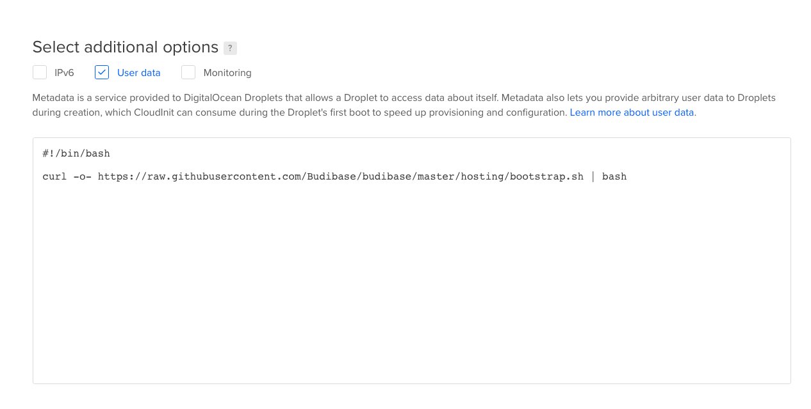

# DigitalOcean


## DigitalOcean Simple Setup

The simplest way to get self-hosted budibase up and running quickly is to use [DigitalOcean](https://www.digitalocean.com). Create an account if you don't have one. You can also use our [referral code](https://m.do.co/c/0caaa6085a82) to get $100 of free DigitalOcean credit!

Follow these steps to set up your budibase instance:

### Create a Docker Droplet

We use [Docker](https://www.docker.com/) and [Docker Compose](https://docs.docker.com/compose/install/) to run budibase. DigitalOcean provides a droplet \(server\) pre-configured with both. Create a docker droplet here:

[https://marketplace.digitalocean.com/apps/docker](https://marketplace.digitalocean.com/apps/docker)

Click **Create Docker Droplet** to get to the configuration screen.

### Set Up Droplet

Now it's time to configure your droplet.


The smallest droplet \(1GB\) will run the platform well, but we recommend larger instances for higher volume use cases.

Choose where you would like to host your droplet by clicking on one of the flags in the datacenter region section, or leave as default to host in New York.

Next, we need to paste our userdata into the relevant area. Userdata is a script that runs to configure our budibase instance when it boots. All you need to do is click the "User data" checkbox under **Additional Options**, and paste the following:

```bash
#!/bin/bash

curl -o- https://raw.githubusercontent.com/Budibase/budibase/master/hosting/bootstrap.sh | bash
```

Your setup should look like this:



Now, create a password for your instance. This allows you to access your instance later on.


Finally, click the **Create Droplet** button at the bottom. This will bring up your shiny new budibase instance, and you can now [configure your builder](../builder-settings.md) to deploy your budibase applications to your new instance!

### Video

If you are more of a visual person, here's an instructional video showing how to perform the above simple DigitalOcean installation.



## 

